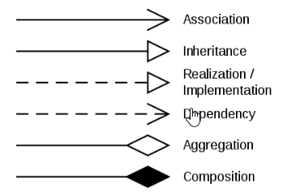

### KISS
"**Keep it simple, stupid!**"

### SOLID
Principles of OOP, it is an acronym to make OOP design more understandable, flexible, maintainable.
- *Single-responsibility principle*: Every class has one responsibility 
- *Open-closed principle*: Software entities should be open for extension but closed for modification
- *Liskov Substitution principle*: Functions that use pointers or references to base classes must be able to use objects of derived classes without knowing it
- *Interface Segregation principle*: Clients shouldn't be forced to depend on interfaces they don't use
- *Dependency Inversion orinciple*: Depend on abstractions, not concretions.

### Class Diagrams
The purpose of class diagrams is to show the layout of how classes are interacting with each other.

