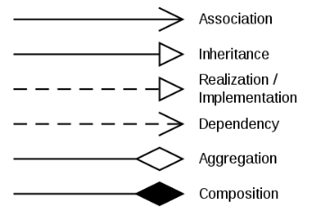

The page for java.

### Core concepts

> Useful links:
- [[Baeldung | https://www.baeldung.com]]
- [[Big Decimal | Training.Intellij.BigDecimal]]
- [[Access Modifiers | Training.Intellij.Modifiers]]

### Data Structures

### Visibility keywords

### Extras
- [[ Testing concepts | Training.JUnit.Testing ]]
- [[ Testing with JUnit | Training.JUnit]]
- [[ Maven lifecycle | Training.Intellij.Maven]]

### UML Class Design choices

[[Understand symbols | https://learn.microsoft.com/en-us/previous-versions/visualstudio/visual-studio-2015/modeling/uml-class-diagrams-reference?view=vs-2015]]