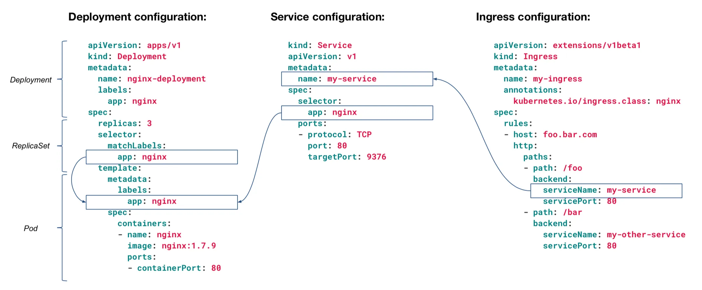

## Kubernetes
Kubernetes is an open source platform for managing containerized workloads and services, it is basically a way of managing the complexity of multi-container environments via orchestration.
It helps with *scaling, deployment, automation, and workload management*.
It is also known as *K8s*, it can scale containers across machines and can auto-heal when a container fails. 
A system deployed on Kubernetes is a *cluster* and the brain is called the *control plane* exposing API server handling internal and external requests.
It manages *nodes* (machines) which run *Kubelets* (a tiny application running on the machine to communicate with the main control plane), in nodes are *pods* (containers running together).
It has its own key-value database called *ETCD* which contains info about running the cluster.

## Basics
### Pods
Smallest deployable unit of computing you can create and manage in K8s, it is a group of one or more containers with shared storage and network resources and a specification on how to run them.
They are defined in *yaml* files and run with the command `kubectl apply -f <podFileName.yaml>`.
Generally, pods run a single container but sometimes there is strong coupling and pods can run multiple containers which form a single unit for service.

#### Intro 
1. Create a pod with command `kubectl run nginx-pod --image=nginx`
2. List all running pods `kubectl get pods`
3. Describe pod to get details about pod and its running containers (will also list events that happen at the bottom as a history) `kubectl describe pod nginx-pod`
4. Now expose pod outside the cluster - do this with a port-forward. This will stay running on window until stopped via `Ctrl+C`, and can now be accessed from the browser: `kubectl port-forward pod/nginx-pox 8080:80`
5. Then clean up the resources via `kubectl delete pod nginx-pod`

#### YAML
Its not the ideal solution to use all commands like above, so you can declare kubernetes resourcing through yaml files.
```yaml
apiVersion: v1
kind: Pod
metadata:
    name: nginx-pod
spec:
    containers:
        - name: nginx
          image: nginx
          ports:
            - containerPort: 80
```
Key notes: the name is `nginx-pod`, name of the pod and you'll see it when running `get pods` command. The `containers`, the *container for the pod to startup with* (this is a list so there can be multiple containers, not generally used - generally its 1-1).

To run the yaml into the cluster: `kubectl apply -f <podFile>.yaml`
### Deployments
Deployment provides declarative updates for Pods and ReplicaSets.
Can describe a *desired state* in a Deployment, and Deployment Controller changes the actual state to the desired state at controlled rate, can define Deployments to create new ReplicaSets or remove existing Deployments and adopt all resources.<br>
Example deployment:
```yaml
piVersion: apps/v1
kind: Deployment
metadata:
  name: nginx-deployment
  labels:
    app: nginx
spec:
  replicas: 3
  selector:
    matchLabels:
      app: nginx
  template:
    metadata:
      labels:
        app: nginx
    spec:
      containers:
      - name: nginx
        image: nginx:1.14.2
        ports:
        - containerPort: 80
```
Similar to pods, its `kubectl apply -f <nameOfDeployment.yaml>`<br>
And then `kubectl get deployments` to see the running deployments<br>
[[More on deployment spec | https://kubernetes.io/docs/concepts/workloads/controllers/deployment/#writing-a-deployment-spec]]


```Bash
alexajones2@ITEM-S134843:/mnt/c/Users/alexajones2/Training/tutorial-2/training (Alex-Jones/dev) $ kubectl get pods
NAME      READY   STATUS         RESTARTS   AGE
app-pod   0/1     ErrImagePull   0          12s
alexajones2@ITEM-S134843:/mnt/c/Users/alexajones2/Training/tutorial-2/training (Alex-Jones/dev) $ docker tag jsf-app:latest localhost:5000/jsf-app
alexajones2@ITEM-S134843:/mnt/c/Users/alexajones2/Training/tutorial-2/training (Alex-Jones/dev) $ docker push localhost:5000/jsf-app
Using default tag: latest
docker-credential-secretservice: error while loading shared libraries: libsecret-1.so.0: cannot open shared object file: No such file or directory
The push refers to repository [localhost:5000/jsf-app]
9d18b9f0f029: Pushed
487bd68d091a: Pushed
9ccda1f6e03d: Pushed
694630803427: Pushed
25f4ff8a1284: Pushed
fa3b6a1ea5c4: Pushed
51566e3f832b: Pushed
51774d97c868: Pushed
ea20c4bf3aae: Pushed
2c8d31157b81: Pushed
7b76d801397d: Pushed
f32868cde90b: Pushed
0db06dff9d9a: Pushed
latest: digest: sha256:0e86d9afca2285e5664c5658c091f6ca52f337e39db013c15eedba67df75deaf size: 3054
alexajones2@ITEM-S134843:/mnt/c/Users/alexajones2/Training/tutorial-2/training (Alex-Jones/dev) $ kubectl get pods
NAME      READY   STATUS         RESTARTS   AGE
app-pod   0/1     ErrImagePull   0          97s
alexajones2@ITEM-S134843:/mnt/c/Users/alexajones2/Training/tutorial-2/training (Alex-Jones/dev) $ kubectl delete pod app-pod
pod "app-pod" deleted
alexajones2@ITEM-S134843:/mnt/c/Users/alexajones2/Training/tutorial-2/training (Alex-Jones/dev) $ kubectl apply -f pod-app.yaml
pod/app-pod created
alexajones2@ITEM-S134843:/mnt/c/Users/alexajones2/Training/tutorial-2/training (Alex-Jones/dev) $ kubectl get pods
NAME      READY   STATUS              RESTARTS   AGE
app-pod   0/1     ContainerCreating   0          4s
alexajones2@ITEM-S134843:/mnt/c/Users/alexajones2/Training/tutorial-2/training (Alex-Jones/dev) $ kubectl get pods
NAME      READY   STATUS    RESTARTS   AGE
app-pod   1/1     Running   0          10s
```

### Services

Every Pod in a cluster gets its own unique cluster-wide IP address, so you don't need to explicitly link Pods and almost never deal with mapping container ports to host ports.
Creating a clean, backwards-compatible model where Pods can be treated much like VMs or physical hosts from perspectives of port allocation, naming, service discovery, load balancing... etc.

A *service* is an abstract way to expose an application running over a set of Pods as a network service. 
Pods are non-permanent resources so are created and destroyed to match desired cluster state.
In *Kubernetes* a service is a **REST** object like a Pod, you can `POST` a service definition to the API server to create a new instance.


### Ingress
Is effectively meant to do the `kubectl port-forward <resource>/<resource-name> <localport>:<containerPort>` legwork, but doesn't for some stupid reason.


[[Relation of deployment service and ingress | https://dwdraju.medium.com/how-deployment-service-ingress-are-related-in-their-manifest-a2e553cf0ffb]]

Ingress resources MUST always have a controller, with Rancher desktop this defaults to *traefik* [[traefik ingress docs | https://doc.traefik.io/traefik/providers/kubernetes-ingress/]]

### Namespaces
Are a great way to organise clumps of clustered things together so you don't get cluttered kubectl outputs.
To create a new namespace `kubectl create namespace <name>` and can see all namespaces with `kubectl get namespaces`.
These are useful as you can limit resources on given namespaces, but when trying to find any of the resources you must add the flag `-n=<namespace-name>`.

```bash
alexajones2@ITEM-S134843:/mnt/c/Users/alexajones2/app (Alex-Jones/dev) $ kubectl config view
apiVersion: v1
clusters:
- cluster:
    certificate-authority-data: DATA+OMITTED
    server: https://192.168.184.120:6443
  name: rancher-desktop
contexts:
- context:
    cluster: rancher-desktop
    user: rancher-desktop
  name: rancher-desktop
current-context: rancher-desktop
kind: Config
preferences: {}
users:
- name: rancher-desktop
  user:
    client-certificate-data: DATA+OMITTED
    client-key-data: DATA+OMITTED
alexajones2@ITEM-S134843:/mnt/c/Users/alexajones2/app (Alex-Jones/dev) $ kubectl change namespace
error: unknown command "change" for "kubectl"
alexajones2@ITEM-S134843:/mnt/c/Users/alexajones2/app (Alex-Jones/dev) $ kubectl config get-context
error: unknown command "get-context"
See 'kubectl config -h' for help and examples
alexajones2@ITEM-S134843:/mnt/c/Users/alexajones2/app (Alex-Jones/dev) $ kubectl config get -context
error: unknown shorthand flag: 'c' in -context
See 'kubectl config --help' for usage.
alexajones2@ITEM-S134843:/mnt/c/Users/alexajones2/app (Alex-Jones/dev) $ kubectl config get-contexts
CURRENT   NAME              CLUSTER           AUTHINFO          NAMESPACE
*         rancher-desktop   rancher-desktop   rancher-desktop
alexajones2@ITEM-S134843:/mnt/c/Users/alexajones2/app (Alex-Jones/dev) $ kubectl config set-contexts --current --namespace=tomcat
error: unknown flag: --current
See 'kubectl config --help' for usage.
alexajones2@ITEM-S134843:/mnt/c/Users/alexajones2/app (Alex-Jones/dev) $ kubectl config set-context --current --namespace=tomcat
Context "rancher-desktop" modified.
alexajones2@ITEM-S134843:/mnt/c/Users/alexajones2/app (Alex-Jones/dev) $ kubectl config get-contexts
CURRENT   NAME              CLUSTER           AUTHINFO          NAMESPACE
*         rancher-desktop   rancher-desktop   rancher-desktop   tomcat
```

### Data Storage
### Configuration and Secrets

## Rancher Desktop
- [[Confluence Practical example | https://confluence.apak.com/live/display/~rich.ellor/Docker+and+Kubernetes+Practical+Example#DockerandKubernetesPracticalExample-Kubernetes(RancherDesktop)]]
- [[Kubernete and Helm | https://confluence.apak.com/live/display/~rich.ellor/Kubernetes]]