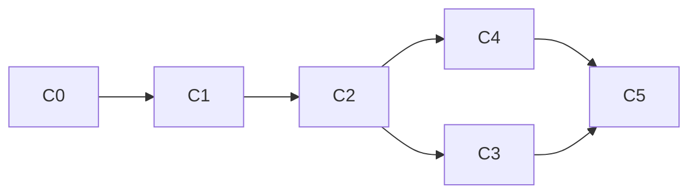
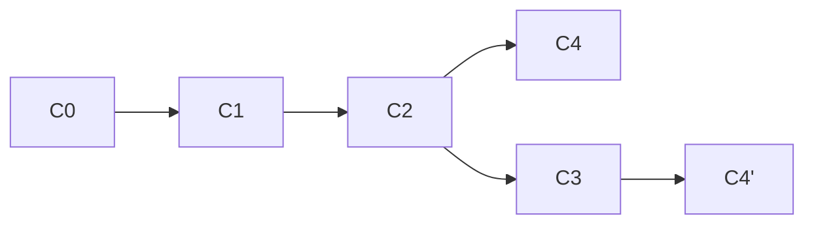
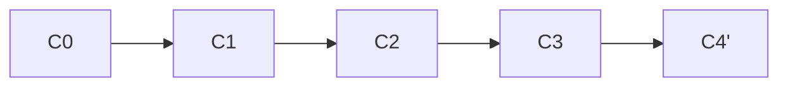

## Learning Objectives
- Basics of Version Control
- How to use Git Bash
- Simple git commands
- Git Branching structure

### Basics of Version Control
When using the `git add` command this is called *adding to the index*.
> Note: Some useful links are:
- [[Git documentation | https://git-scm.com/docs]] 
The Git documentation also has access to the Git pro book which shows examples of many of the core features.
- [[Atlassian Guide to Git | https://www.atlassian.com/git]] 

### How to use Git Bash
You can use `git --help` inside the bash terminal to see a list of commands, to open bash in a directory quickly you can navigate there in the file explorer and `Right click -> Open Git Bash here`.  

### Simple git commands
- `git init` - used in folder to initialise git repo
- `git clone <repo>` - used to clone a repository onto the local machine
- `git log` - to log all commits in the repo, can use `--oneline` and `--graph` to make it more readable 
- `git pull` is a `git fetch` followed by a `git merge` which will update your files based on what is on the server, should be done before pushes to avoid conflicts

However, if you've made mistakes you wish to revert there are a few options:
- `git reset` - updates the branch and moves the tip to add or remove commits, effectively altering the history (`git reflog` instead of `git log` is able to show you the history even after changes and alterations)

(`--hard` modifier will reset index and working tree and discard local changes, whereas `--soft` doesn't touch the index or working tree but will reset the head to the last commit and leave changed files as untracked once again.)
- `git revert` - makes a new commit showing that changes have been reverted
- `git restore` - local changes, undoing tracked changes from the index, without updating the branch

#### Committing
- `git status` - shows status of the files in the local version of the repository, untracked means that they will not get pushed to remote
- Using `git commit` will open the default editor, as some basics, you should separate subject line from the body of text. The subject line should be an imperative able to complete the sentence *If applied, this commit will * ***your subject line here***
- For subject line don't end it with a full-stop and capitalise the sentence
- Keep it under 50 characters (if it needs to be more than this its likely you've committed too much at once)
- **Use the imperative mood**

### Git branching structure
- `git checkout -b {branchname}` is a faster way of making a new branch and switching to it straight away
- `git branch --list` to list the branches, highlights what you're on now
- ``git checkout master && git log --oneline -n 2` is demonstrating the use of double ampersand which runs the second command only after successful completion of the first
- `git branch --show-current` is a quick way to show the branch you're on
- When using `git merge fromBranch` you want to be on the target branch to be merged into

This graph effectively shows how a merge works (C4 being a different branch and then being merged so that C5 is master)
- However, with `git rebase toBranch` you want to be on the branch whose history you want changed with the history from the *toBranch*

From the graph above, using `git rebase master` you would then nullify the need for C4, from here you can simply do a `git checkout master && git merge branchName` to get the below timeline.

Neither is better than the other and are viewed in differing lights depending on who you ask however both have their uses and should be treated as entirely different entities as such. `Git rebase` is an effective rewrite of the history, **however** it can make the reading of the project history much easier for future users, therefore when combined with squashing or cherry-picking it could be an invaluable tool for the readability of commit history.

- Below is a simple show of what a `git log` command can achieve, the reason we output 5 is past that it showed all commits to every branch

#### Stashing
Useful for when you've been working on one branch but urgently need to switch to another branch for something like a bug fix. This command is for when you don't want to commit half completed work. Simply type `git stash` once things are added to the index, then to retrieve you can `git stash pop`. If you've stashed multiple you can view with `git stash list`.
With multiple things stashed you can instead use `git stash apply stashName`.

#### Cherry picking
`git cherry-pick` command can take the change from a single commit and try and re-introduce it to whatever branch you're currently working on.
Simply `git cherry-pick codeOfCommit` where the code is like the above (i.e. *2dd380fdb*).

#### Git renaming commits of whole branch 
To amend last commit `git commit --amend`.
To rewrite a range of commits, it is also easy using the `filter-branch` command:

`git filter-branch --msg-filter 'printf "THE_PREFIX " && cat' {firstCommit}..HEAD(or{CommitToGetTo})`

This doesn't overwrite any timestamps or anything and just appends that message.
For example:
