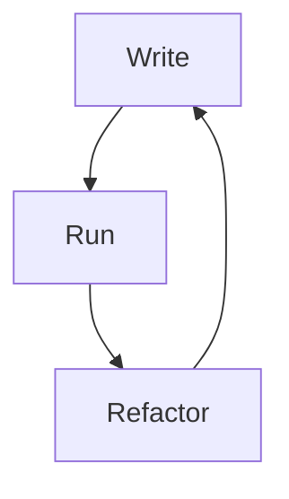

This page will cover the first 3 learning objectives of the above page.
> Learning Objectives
- Different kinds of test: *Unit, Integration, End to End*
- Differences between automated and manual testing
- Testing best practices

## Types of test
- ***Unit testing*** : extremely low level and close to the source of app, testing of individual methods/functions, components, or modules ued by software.
Cheap to automate and can run quickly on continuous integration server.
- ***Integration testing*** : these verify that modules or services can work well together. Can be something like *testing interaction with database*, these are more expensive to run as they require multiple parts of the app up and running.
- ***Functional testing*** : focus on business requirements, only verify output of an action and don't check intermediate states of the system. Similar to integration tests but *if the integration tests verifies you get a response from the database, the functional test would verify the response is a specific value*.
- ***End to End testing*** : replicates user behaviour with software in complete app environment. 
Verifies various user flows work as expected and can be simple as loading a web page or much more complex scenarios like online payments.
- ***Acceptance testing*** : formal tests to verify a system satisfies business requirements.
- ***Performance testing*** : evaluate how system performs under a given workload, help measure *reliability, speed, scalability, and responsiveness* of an application.
- ***Smoke testing*** : basic tests to check basic functionality. Quick to execute and should give you assurance that major features work as expected.

***

## Automated vs Manual
*Manual* testing is done in person by interacting with the software and APIs, expensive as takes someone to setup environment and execute tests themselves and can be prone to human error.

*Automated* testing is performed via test scripts written in advance, these tests can vary in complexity, checking a single method in a class to making sure that performing a sequence of complex actions in the UI leads to consistent results.
These are much more robust and reliable than manual testing, however the quality **solely relies** on how well the scripts were written.
This type of testing is a key component of **CI/CD** of the DevOps mentality.

There is still value in manual testing, known as *exploratory testing*.

*** 
## Best Practices
This example is for web apps.
- Functional testing
- Usability testing
- Interface testing
- Database testing
- Performance testing
- Compatibility testing
- Security testing

[[Web app testing | https://www.browserstack.com/guide/web-application-testing-checklist]]

> JUnit best practices: [[JUnit Practices|Training.JUnit.JUnitBasics]]

***
## Test Driven-Development
Software development approach also referred to as **TDD**, where test cases are developed to specify and validate what the code will do. 
In simple terms, test cases for each functionality are created and tested first, if test fails then new code is written to pass the test.
Starts with designing and developing tests for every small functionality of application.
Only write new code if automated test fails, thereby stopping duplication.

TDD cycle:


TDD is neither about "*testing*" nor "*design*". 
It also doesn't mean "write some tests, then build a system that passes", and it doesn't mean "do lots of testing".
TDD is primarily a specification technique, ensures that source code is thoroughly tested.

## JUnit Object Instantiation
[[Martin Fowler JUnit New Instance | https://martinfowler.com/bliki/JunitNewInstance.html]]
```Java
import junit.framework.*;
import java.util.*;

public class Tester extends TestCase {
  public Tester(String name) {super(name);}
  private List list = new ArrayList();
  public void testFirst() {
    list.add("one");
    assertEquals(1, list.size());
  }
  public void testSecond() {
    assertEquals(0, list.size());
  }
}
```

Both of these tests pass regardless of order because JUnit creates *two* instances of Tester, one for each test method. 
This is a conscious design decision, one key principle is that of **isolation** - *no test should ever do anything that would cause other tests to fail*.

The advantages of isolation are:
- Any combination of tests can be run in any order with the same results
- You never have a situation where if one test fails the cause is another test and its writing
- If one test fails you don't need to worry about debris causing other tests to fail

This is why JUnit provides other mechanisms to support isolation, in particular *setUp* and *tearDown* methods to run at the beginning and end of each test method. 
By making these methods static, you save duplication of code and so instantiation should occur in the before methods.