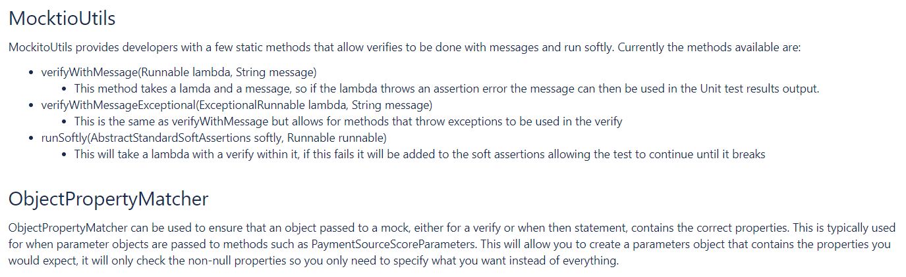

Discouraged ugly imports
```Java
import org.mockito.Mockito;
import org.mockito.Matchers;
 
@Test
public void testSomething() {
    MyClass mcl = Mockito.mock(MyClass.class);
    Mockito.when(mcl.myMethod(Matchers.eq(true), Matchers.any(OtherClass.class)));
}
```
Encouraged static imports
```Java
import static org.mockito.Mockito.mock;
import static org.mockito.Mockito.when;
import static org.mockito.Matchers.eq;
import static org.mockito.Matchers.any;
 
@Test
public void testSomething() {
    MyClass mcl = mock(MyClass.class);
    when(mcl.myMethod(eq(true), any(OtherClass.class)));
}
```

### Model Objects
Avoid using mocks of the model objects.
They don't have behaviour associated with them, so it's just as easy to just make some model objects and use those.

Builders have been created to make mocking model objects easier, most of these will be switched to creating real objects and not mocks. 
Some will remain as mocks due to the complex behaviour that is likely to be refactored out in the future.

### InjectMocks and Mock Annotation
The `@InjectMocks` and `@Mock` annotation can be used in test classes when the **class** has the following annotatioon `@RunWith(MockitoJUnitRunner.class)`.
- *InjectMocks* - lets you define the class you want to test as a class variable 
- *Mock* - lets you test any other services class uses

The runner will automatically inject the mock services into the class with InjectMocks allowing you to quickly setup the class you want to test.

**The Mock annotation should *not* be used to mock model objects or other value holding objects**.


### Final Methods
Mockito functions in a way that if you declare a method as final it'll go badly.
Might not even be able to inform you of this final method, generally it'll run the real method and this will throw an error as the mock has no internal state.

Some WFS MockitoUtils


[[More Best Practices | https://mestachs.wordpress.com/2012/07/09/mockito-best-practices/]]

### Don't mix with Spring Integration Test
Mixing spring integration and mockito can produce strange effects like **singleton replaced by mocks** and will also lose the speed of mockito testing.

### Avoid abstract testcases
When something breaks it takes too long to diagnose ... an alternative is creating a custom assertion and factory methods that can be reused -> prefer [[composition | Training.Java.Design]] over inheritance

### Don't mock your model
Preference of using your model 
```Java
Campaign campaign = new Campaign();
campaign.setAssignee(office);
campaign.setType(PersonTypeCode.MEMBER);
campaign.setCreationUserLocation(office);
campaign.setOrganization("google");
campaign.calculateEndDate();
```
Instead of mocking
```Java
Campaign mockCampaign = mock(Campaign.class);
when(mockCampaign.getAssignee()).thenReturn(office);
when(mockCampaign.getType()).thenReturn(PersonTypeCode.MEMBER);
when(mockCampaign.getCreationUserLocation()).thenReturn(office);
when(mockCampaign.getOrganization()).thenReturn("google");
when(mockCampaign.getCalculatedEndDate()).thenReturn(new DateMidnight());
```
Easier to read and you are able to add convenient constructor/factory methods to your production or test codebase ... remember to put the code where it belongs

### Don't abuse mocks
If you have a hammer, everything looks like a nail.<br>
For example testing an xstream converter *DescriptionTargetConverter*.
Don't use mock, it requires more code... and you don't really verify the output xml format.

### Don't mock servlet API
The `org.springframework.mock.web` package contains set of Servlet API mock objects, targeted at usage with Spring's Web MVC framework, useful for testing web contexts and controllers.

### Don't replace asserts with verify
Easiest methods to understand and test are methods that perform some sort of work.
You run the method and then use asserts to make sure everything worked.

In contrast, mock objects make it easy to test delegation, which is when some object other than the SUT is doing work. 
Delegation means the method's purpose is *to produce a side-effect*, not actually perform work. 
Side-effect code is sometimes needed, often more difficult to understand and debug.

### If it's hard to...
If it's hard to read ... it's hard to test.<br>
If it's hard to test ... it's hard to use. <br>
If it's hard to test ... you're probably doing it wrong. <br>
Ifs it's hard to test ... take a look at the design and test it again!