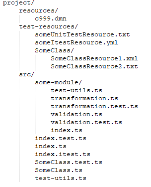

## Common conventions
- Config files live in the *root* directory of a project with all `.js/.ts` files living in a directory called `src`
- Source code is divided up into folders called modules, each of which has an `index.ts` (or `index.js`) file at the root level, individual files are **also modules**
- The root `index.ts` file in a project is the starting point for the control flow
- Units of code that can be ported are sometimes referred to as components and include **types, variables and functions**
- Within a module, *any* exported component can be imported by any file
- Components to be exported **outside of a module**, as well as being exported where declared are re-exported in `index.ts` using the `from` keyword to reference the file it's declared in. This allows control over a module's external exports, essentially providing a public/private model for module components.
- When importing a component from another module, the module name is used, and not the name of the file where the component is declared. Imports using module names like this automatically look in the index file of the module

[The SBS Standard can be found under Code Structure](https://confluence.apak.com/live/x/ZqyBAw)

A couple of project structure conventions for IL projects
- We create a `model.ts` file within each module, containing all of the abstract types (interfaces & type aliases) & sometimes enums
- we have a `resources` & a `test-resources` directory in the root of the project. Details of the utilities below:
- resource files (non-code files, e.g. xml, used by production code) should be in a folder named 'resources' at the root level of the project.
- unit test files, such as index.test.ts, should be located alongside the file that they test, as per the TS coding guidelines
- the same should be true for integration tests, such as index.itest.ts (the guidelines say that tests can be kept separately from the files they test, in order for resources to be bundled with them, however that isn't necessary for us as we put such resources into a root level
- test resources (non-code files used only by test suites) should be put into a top level folder of the project (alongside "resources" folder), named "test-resources". 
- test utils (TypeScript helper functions for test suites to invoke) should be put in a file named "test-utils.ts" within the module in which they're used. Note it is not a requirement to separate all helper functions from the test suite to which they pertain like this - it's for when multiple test suites use the same logic to facilitate testing. It could also be used for suites which just have a large amount of logic outside the tests themselves, if you see fit.
if multiple modules need to use the same test util, put the pertinent test-utils file in the nearest common ancestor module of all suites using it.

