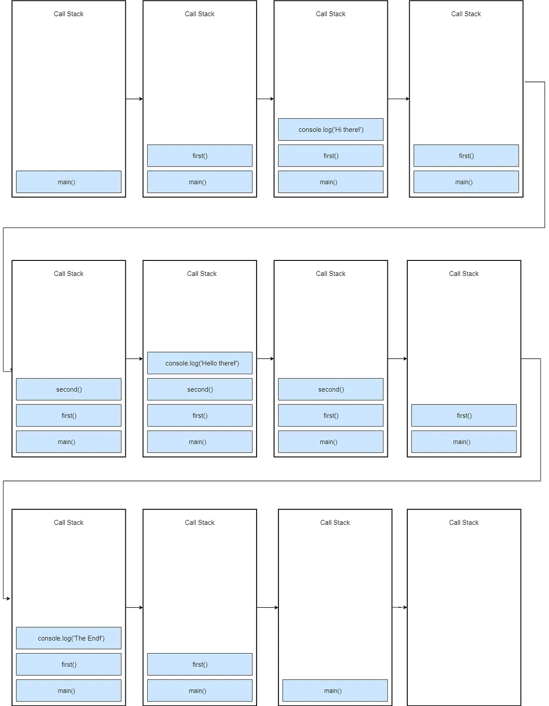

## Call stack
```js
const second = () => {
  console.log('Hello there!');
}
const first = () => {
  console.log('Hi there!');
  second();
  console.log('The End');
}
first();
```


## Event loop and callback queue (task queue)
If you create asynchronous methods then you need to understand the **event loop**, **web APIs**, and **message/task queue** aren't part of JS engine. But part of the browser's JS runtime environment of Nodejs JS runtime environment. So this code below would function as pictured.
```js
const networkRequest = () => {
  setTimeout(() => {
    console.log('Async Code');
  }, 2000);
};
console.log('Hello World');
networkRequest();
console.log('The End');
```


Instead of the main thread just freezing. The event loop just needs to look into the call stack and see if its empty. If it is, it looks in the message queue to see if there are pending callbacks waiting for executions.

The *message queue* also contains callbacks from the DOM (Document Object model) like click events and keyboard events.

[This link shows the difference between job and message queues and priority in ES6](https://blog.bitsrc.io/understanding-asynchronous-javascript-the-event-loop-74cd408419ff)

[Information on asynchronous nature of setTimeout](https://developer.mozilla.org/en-US/docs/Web/API/Window/setTimeout)

[Promises and setTimeout under the hood](https://insights.encora.com/insights/javascript-settimeout-and-promise-under-the-hood)

```js
let print3 = async()=>{
 return new Promise((resolve,reject)=>{ // This line executes 7th and add callback function to the mictotask queue.
 setTimeout(()=>{ // microtask queue content: console.log(2) and setTimeout(console.log("3"), 100)
 console.log("3"); // this line moved to the end of the macrotask,
 resolve();
 },100) // macrotask queue content: console.log("5") in 200ms console.log("3") in 100ms
 })

}

let print = async () => {
 console.log("1"); // This line executes 3rd and print 1
 setTimeout(() => { // This line executes 4th and add call back function inside macrotask queue.
 console.log("5"); // macrotask queue content: console.log("5")
 }, 200);
 return new Promise(async (resolve,reject)=>{ // This line executes 5th and add callback function to microtask queue.
 console.log("2"); // microtask queue content: console.log("2")
 print3(); // This line executes 6th and call print3 function
 resolve();
 console.log("4"); // this line executes 8th and print 4
 })
};

let start=async()=>{
print(); // This line executes 2nd and call print function
 console.log("done") // this line executes 9th and print done
};

start(); // This line executes 1st and call start function
```
1. Begin with the start () function
2. It calls the print () function
3. Now inside the print function, the call stack will check for all the blocking statements and execute those first. Then, the blocking statement “console.log (“1”)” gets executed and the output is “1”.
4. The next statement is setTimeout() that adds the callback function to execute (console.log (“5”), 200ms) to Macro-task and proceed to the next statement.
5. The next statement is Promise, also a non-blocking statement and hence the callback function executes (console.log (“2”)) to micro-task.
6. The next call is to the print3 function that executes Promise and adds callback function to the micro-task to execute (setTimeout (console.log (“3”)), 100ms). The event loop decides which task has highest priority from event queue.
7. Since Promise has a higher priority compared to the setTimeout(), hence the output is “2” and “4”.
8. Execution then moves back to the last statement of start () function and outputs “done”.
9. All the blocking statements and micro-tasks have been executed and the call stack is empty.
10. Macro-task (setTimeout) executes. In Macro-task setTimeout that has a lower time delay, executes first hence the output is “3” followed by “5”.


[A helpful tutorial surrounding calling a pokemon API with promises](https://www.freecodecamp.org/news/javascript-promise-tutorial-how-to-resolve-or-reject-promises-in-js/)

[Finally examples of promises then vs then catch](https://dmitripavlutin.com/javascript-promises-then-vs-then-catch/)
```js
function success(value) {
  console.log('Resolved: ', value);
}

function error(err) {
  console.log('Error: ', err);
}
function rejectSuccess(invalidValue) {
  console.log('Invalid success: ', invalidValue);
  return Promise.reject('Invalid!');
}

Promise.resolve('Zzz!')
 .then(rejectSuccess, error);
// Logs 'Invalid success: Zzzzz!'

Promise.resolve('Zzz!')
 .then(rejectSuccess)
 .catch(error);
// Logs 'Invalid success: Zzzzz!'
// Logs 'Error: Invalid!'
```
`Promise.resolve('Zzz!').then(rejectSuccess, error)` only calls rejectSuccess, even if rejectSuccess returns a rejected promise. error callback is not invoked.

`Promise.resolve('Zzz!').then(rejectSuccess).catch(error)` calls rejectSuccess because the promise is resolved. But rejectSuccess returns a rejected promise, — it is caught by `.catch(error)` and the error callback is invoked. That's the difference.

[More intricacies of Async syntax](https://www.w3schools.com/js/js_async.asp)
```js
async function myFunction() {
  return "Hello";
}

/// IS THE SAME AS
function myFunction() {
  return Promise.resolve("Hello");
}
```