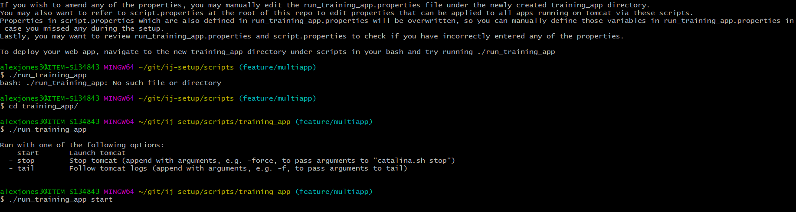

### Tomcat setup
- Cloned the `ij-setup` repo into `C:\Users\alexajones2\git` file-path
- Checked out `feature/multiapp` branch
- `cd /scripts` and then ran `./setup_new_webapp`
- Port same as Jenkins `localhost:8080` and debug port is `localhost:8000`
- set the content root to `src\main\web`
- to edit any of this edit the `run_training_app.properties` file in the `training_app` dir

- `script.properties` is applied to all apps on tomcat, if they're redefined in the `run_training_app.properties` they'll override the ones set in the root at `script.properties`
- In POM make sure maven-war plugin is there and then change `<packaging>jar</packaging>` to *war* and then run an `mvn clean verify` or similar command after project reload


### Issues I ran into
- [[Issues with port binding| https://www.baeldung.com/tomcat-bind-exception]]
- [[LifecycleException | ]] - initialising protocolhandler failing, similar as above, first of all I had to delete my scripts and servers folder with `rm -rf scripts/` and servers respectively.
- then I reran the ide_setup.sh script to reinitialise these folders
- The trouble was coming from windows using port 8005 for a subprocess
- so I reran the :
```shell
alexjones3@ITEM-S134843 MINGW64 ~/scripts
$ ./setup_new_webapp

Name of app in snake case [e.g. test_app]: training

Attempting to create directory training in current directory...

Directory does not exist. Creating directory training...

Directory training created in current directory.

Creating scripts in training directory...

Scripts for training created.

Creating .properties files in training directory ...
Persisting property APP_NAME=training to training/run_training.properties...

Path to your app's repo [e.g. C:\Users\user\git\WFS]: C:\Users\alexajones2\Training\tutorial-2\training
Persisting property APP_HOME=C:\Users\alexajones2\Training\tutorial-2\training to training/run_training.properties...

Folder name of module to be deployed [e.g. wfs-ui, or blank if not a multi-module maven project]:
Persisting property DEPLOYMENT_MODULE= to training/run_training.properties...

Fully qualified path to exploded war (leave empty if generated by maven)
[e.g. C:\Users\user\git\wfs\wfs-ui\target\wfs-ui-8.70-SNAPSHOT]:
Persisting property WAR_PATH= to training/run_training.properties...

Path to web application content root (directory where .xhtml files are located, relative to application root): webroot
Persisting property WEBROOT=webroot to training/run_training.properties...

Path to JDK (leave empty if using your default JAVA_HOME environment variable):
Persisting property JDK_PATH= to training/run_training.properties...

Path to Maven (leave empty if using your default M2_HOME environment variable)
Persisting property MAVEN_HOME= to training/run_training.properties...

HTTP port to access application [defaults to 8080 if left blank]: 8081
Persisting property HTTP_PORT=8081 to training/run_training.properties...

The debug port exposed to connect a debugger to the running web application [defaults to 8000 if left blank]: 8006
Persisting property DEBUG_PORT=8006 to training/run_training.properties...

Context path for URL (i.e. http:://localhost:8081/<context path>) [defaults to TRAINING if left blank]:
Persisting property CONTEXT_PATH=TRAINING to training/run_training.properties...

Setting Catalina base directory to $HOME/servers/$CONTEXT_PATH-tomcat...
Persisting property CATALINA_BASE_DIR=$HOME/servers/$CONTEXT_PATH-tomcat to training/run_training.properties...
Resolving operating system...Persisting property OS=WINDOWS to training/run_training.properties...
Setup completed

If you wish to amend any of the properties, you may manually edit the run_training.properties file under the newly created training directory.
You may also want to refer to script.properties at the root of this repo to edit properties that can be applied to all apps running on tomcat via these scripts.
Properties in script.properties which are also defined in run_training.properties will be overwritten, so you can manually define those variables in run_training.properties in case you missed any during the setup.
Lastly, you may want to review run_training.properties and script.properties to check if you have incorrectly entered any of the properties.

To deploy your web app, navigate to the new training directory under scripts in your bash and try running ./run_training
```
Debug is at 8006 for training tomcat<br>
And webapp is at 8081<br>

But I had to go into `~\servers\TRAINING-tomcat\conf\server.xml and change the shutdown port to 8007 as windows is using 8005

### Running Tomcat
```bash
Using CATALINA_BASE:   /c/Users/alexajones2/servers/TRAINING-tomcat
Using CATALINA_HOME:   /c/Users/alexajones2/servers/apache-tomcat-9.0.20
Using CATALINA_TMPDIR: /c/Users/alexajones2/servers/TRAINING-tomcat/temp
Using JRE_HOME:        C:\Program Files\Java\jdk1.8.0_202
Using CLASSPATH:       /c/Users/alexajones2/servers/apache-tomcat-9.0.20/bin/bootstrap.jar:/c/Users/alexajones2/servers/apache-tomcat-9.0.20/bin/tomcat-juli.jar
Tomcat started.
                at org.apache.catalina.core.StandardServer.stopInternal(StandardServer.java:994)
                at org.apache.catalina.util.LifecycleBase.stop(LifecycleBase.java:257)
                at org.apache.catalina.startup.Catalina.stop(Catalina.java:706)
                at org.apache.catalina.startup.Catalina$CatalinaShutdownHook.run(Catalina.java:803)
11:54 XmlWebApplicationContext INFO  org.springframework.web.context.support.XmlWebApplicationContext - Closing Root WebApplicationContext: startup date [Thu Jan 19 11:52:13 GMT 2023]; root of context h
19-Jan-2023 11:54:32.765 WARNING [Thread-5] org.apache.catalina.loader.WebappClassLoaderBase.clearReferencesJdbc The web application [TRAINING] registered the JDBC driver [org.postgresql.Driver] but faio prevent a memory leak, the JDBC Driver has been forcibly unregistered.
19-Jan-2023 11:54:32.769 INFO [Thread-5] org.apache.coyote.AbstractProtocol.stop Stopping ProtocolHandler ["http-nio-8081"]
19-Jan-2023 11:54:32.771 INFO [Thread-5] org.apache.coyote.AbstractProtocol.stop Stopping ProtocolHandler ["ajp-nio-8009"]
19-Jan-2023 11:54:32.772 INFO [Thread-5] org.apache.coyote.AbstractProtocol.destroy Destroying ProtocolHandler ["http-nio-8081"]
19-Jan-2023 11:54:32.773 INFO [Thread-5] org.apache.coyote.AbstractProtocol.destroy Destroying ProtocolHandler ["ajp-nio-8009"]
Listening for transport dt_socket at address: 8000
19-Jan-2023 11:54:54.416 INFO [main] org.apache.catalina.startup.VersionLoggerListener.log Server version name:   Apache Tomcat/9.0.20
19-Jan-2023 11:54:54.418 INFO [main] org.apache.catalina.startup.VersionLoggerListener.log Server built:          May 3 2019 22:26:00 UTC
19-Jan-2023 11:54:54.418 INFO [main] org.apache.catalina.startup.VersionLoggerListener.log Server version number: 9.0.20.0
19-Jan-2023 11:54:54.418 INFO [main] org.apache.catalina.startup.VersionLoggerListener.log OS Name:               Windows 10
19-Jan-2023 11:54:54.418 INFO [main] org.apache.catalina.startup.VersionLoggerListener.log OS Version:            10.0
19-Jan-2023 11:54:54.418 INFO [main] org.apache.catalina.startup.VersionLoggerListener.log Architecture:          amd64
19-Jan-2023 11:54:54.419 INFO [main] org.apache.catalina.startup.VersionLoggerListener.log Java Home:             C:\Program Files\Java\jdk1.8.0_202\jre
19-Jan-2023 11:54:54.419 INFO [main] org.apache.catalina.startup.VersionLoggerListener.log JVM Version:           1.8.0_202-b08
19-Jan-2023 11:54:54.419 INFO [main] org.apache.catalina.startup.VersionLoggerListener.log JVM Vendor:            Oracle Corporation
19-Jan-2023 11:54:54.419 INFO [main] org.apache.catalina.startup.VersionLoggerListener.log CATALINA_BASE:         C:\Users\alexajones2\servers\TRAINING-tomcat
19-Jan-2023 11:54:54.419 INFO [main] org.apache.catalina.startup.VersionLoggerListener.log CATALINA_HOME:         C:\Users\alexajones2\servers\apache-tomcat-9.0.20
19-Jan-2023 11:54:54.420 INFO [main] org.apache.catalina.startup.VersionLoggerListener.log Command line argument: -Djava.util.logging.config.file=C:/Users/alexajones2/servers/TRAINING-tomcat/conf/loggin
19-Jan-2023 11:54:54.421 INFO [main] org.apache.catalina.startup.VersionLoggerListener.log Command line argument: -Djava.util.logging.manager=org.apache.juli.ClassLoaderLogManager
19-Jan-2023 11:54:54.421 INFO [main] org.apache.catalina.startup.VersionLoggerListener.log Command line argument: -Djdk.tls.ephemeralDHKeySize=2048
19-Jan-2023 11:54:54.421 INFO [main] org.apache.catalina.startup.VersionLoggerListener.log Command line argument: -Djava.protocol.handler.pkgs=org.apache.catalina.webresources
19-Jan-2023 11:54:54.421 INFO [main] org.apache.catalina.startup.VersionLoggerListener.log Command line argument: -Dorg.apache.catalina.security.SecurityListener.UMASK=0027
19-Jan-2023 11:54:54.421 INFO [main] org.apache.catalina.startup.VersionLoggerListener.log Command line argument: -agentlib:jdwp=transport=dt_socket,address=localhost:8000,server=y,suspend=n
19-Jan-2023 11:54:54.421 INFO [main] org.apache.catalina.startup.VersionLoggerListener.log Command line argument: -Dignore.endorsed.dirs=
19-Jan-2023 11:54:54.421 INFO [main] org.apache.catalina.startup.VersionLoggerListener.log Command line argument: -Dcatalina.base=C:/Users/alexajones2/servers/TRAINING-tomcat
19-Jan-2023 11:54:54.421 INFO [main] org.apache.catalina.startup.VersionLoggerListener.log Command line argument: -Dcatalina.home=C:/Users/alexajones2/servers/apache-tomcat-9.0.20
19-Jan-2023 11:54:54.421 INFO [main] org.apache.catalina.startup.VersionLoggerListener.log Command line argument: -Djava.io.tmpdir=C:/Users/alexajones2/servers/TRAINING-tomcat/temp

```

Above is what shows when TomCat starts, some problems may arisen as originally was using Environment Variables JDK which was java 11 and could've edited this in the `scripts/<app-name>/run_<app-name>.properties` by using a different classpath but instead changed to Java 8.
This was just in case of Java 11 causing issues.