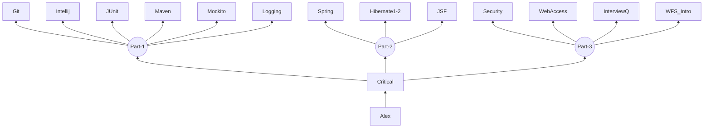
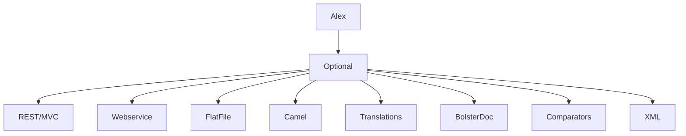

This is an overarching view of the training I complete for Sopra from a dev perspective.
I won't be listing HR training unless information is extremely pertinent.
I will list HR training as a subset for things like computer security and GDPR concepts as these may come up in future.

### Useful Links
- [[Drawing Graphs with mermaid | https://mermaid-js.github.io/mermaid/#/]]