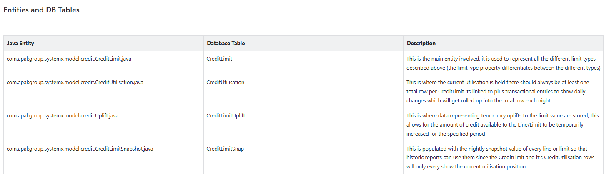

## What are Payment Sources and Payment Settings?
*Insert description on business use of Payment Sources and Settings* 
*Talk about where they're found in the UI and what they link to and affect* 
*Talk about how they can't be deleted and what having certain payment interfaces will do for example, link to a page discussing payment interfaces* 
*Link to page covering the description [Product Documentation](https://sf-wiki.atlassian.net/wiki/spaces/PDN/pages/43192346/Payment+Settings)*

## Key classes involved
*Discuss what db tables are important and where main sources and settings are held* 
*List up to 5 of the really key classes involved* 
Something along these lines.

