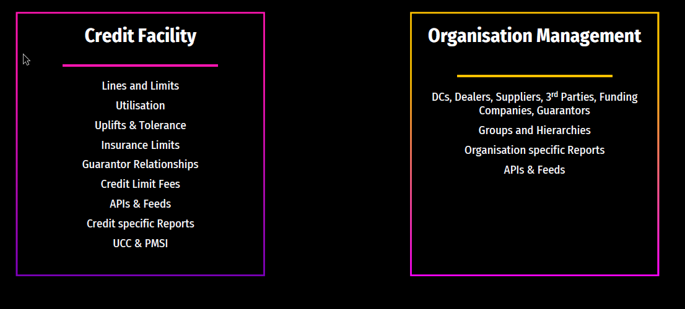

# Objectives Meeting with Chris
Just had my objectives meeting with Chris and have a couple of points to bring back that I thought with Patrick at the helm we could flesh out more as a team, thought I'd leave this all here so we can kind of help each other. My result of the meeting was a couple of concrete goals and a couple of barebones ones, my concrete ones being:

- Wanting to complete IL training, with most people allegedly saying it takes between 10days and 2weeks of consistent work, this puts it as between 75 and 105 hours, which with 2hours KS time per week would make this a 12 month long goal, and with the plan being that IL stuff will be coming to squads this seems important
- Completed - AWS Cloud Practitioner Exam, being that my goal last year was to do the course and I finished the exam just before this year started seems fine to have it listed as already completed but what would've been a goal - obviously next stage on from this is Associate level and there's SysOps, Developer, Cloud Solutions Architect, despite wanting to do one of these I wasn't too sure they aligned with Sopra too much, but could still be keen to have as a goal, unfortunately it would just mean I would have to do it outside of work if all KS time is spent on IL training

The barebones ones are a bit more interesting and where we can kind of think about things, hopefully off the back of one of these goals it could be exceeded by doing some kind of KS but from the 2025 engineering objectives key takeaways appear to be, upping test quality and coverage, increasing documentation, ownership, so was wondering what you think along these lines/if you have any plans for any of the following ⁠

- Onboarding documentation - as our above shows our focuses, we have 13 broken up subcategories, and was wondering if there was a way we could (as a squad) put together onboarding documentation for the eventuality of someone joining the squad, thinking along the lines of, we each have a relatively similar sized chunk and can not only bring in and trim existing stuff from confluence (cutting off the fat), and have the key Business Contexts for each or what things mean (glossaries etc) aswell as key areas of code touched by them so coming into the squad and for example picking up a ticket on Utilisation stuff, they immediately have a fairly quick read to get them up to speed on what that means in the realm of ATROPOS
- Might be useful for the others too so will leave it here but want to chat to Patrick and Paul potentially about consistent bugs that seem to be cropping up for our domain and if there's a way of either increasing test coverage/making maybe functional changes to help mitigate the number of bugs coming in (this would obviously nicely double with writing documentation as will give a more intricate knowledge of how that part works)
- Also chatting amongst ourselves, with Patrick, around a potential other goal that I would like around understanding more around containerisation, me and Chris spoke about the use of WireMock (I've only used it to stub returns from HPI, I think) and how it could potentially be good to have some kind of container or something of that sort (so it can be spun up by anyone) that maybe stubs one of the services we make use of so testing can be easier?
- Finally, something to do with 
    - Identification of a problem area, lacking coverage or testing
    - Refinining knowledge there
    - Taking ownership of creating JIRAs and workloads around how this can be improved

## Chris' notes
Goals
- Mission
    - Documentation
    - Onboarding documentation?
    - Specific Feature?
- Collaborate with Patrick
    - Testing
        - Find a niche area
        - Plan coverage changes
- Collaborate with Patrick
- Cloud Practioner Training - DONE
- Goal: End of Q4 -> Training complete which was the goal
- Exam taken as well on top of that goal, and passed
- Completed - Met/Exceeded Goal

- Professional
- Typescript Training
        - By the end of the year
- Containers?
- Wiremock-esque task for things like bank wizard maybe?

1. **IL Training**
: 
"Complete training on the latest IL modules and report learnings through a presentation or documentation to the team by the end of Q4 2025 (this is a major stretch however, completing this would be fairly monumental), ensuring understanding of key processes and tools."
> GOAL: Complete IL Training 
>> Training project is approved by IL Team 
>> ***End of Q4***

2. **Documentation around Credit-Specific Reports + Help Maintain ATROPOS Team Docs**
:
"Document at least the major 5 credit-specific reports by the end of Q2 2025 and update the ATROPOS team documentation quarterly to ensure that all processes and reports are clearly outlined and up to date."
Remove the maintenance part bit
> GOAL: Document 5 of the credit reports 
>> Leave a structure in the documentation for adding more report specific documentations for later enhancements 
>> Include business relevance as well as key technical areas such as the classes used for it 
>> Peer reviewed by the team to ensure it covers all the required parts 
>> ***End of Q2***

3. **Planning Out the Increase of Testing and Functional Testing around Payment Sources/Payment Settings**
: 
"Increase testing coverage on Payment Sources and Payment Settings by X% (figure out percentage increase by end of Q2 2025) by the end of Q4 2025, including functional tests, edge case scenarios, and a clean and organized testing area." 
**Breakdown of sub-tasks:**
    - **Gathering Knowledge of All Classes Touched and Majorly Key Ones:** "By the end of Q2 2025, gather and document relevant classes affected by Payment Sources and Settings, with a focus on at least 3 key classes for further testing."
        - 3 classes documented and peer reviewed by 
        - ***End of Q2***
    - Gathering Knowledge on Context of All Bugs and Identifying Common Points of Failure: "Review and analyze past bugs in current backlog and up to 1 year ago related to Payment Sources/Settings by the end of Q3 2025, identifying at least 3 common failure points for targeted testing."
        - Tangent: If they are scripts, maybe a recovery tool for the functional goal below?
        - Label them in Jira? Easy to check back in on them and get an export
        - Produce a document/powerpoint and present it back to the Product Manager/Engineering Lead on the team
        - ***End of Q3***
    - Designing New Edge Cases and Testing Scenarios, Removing Superfluous Ones: "By the end of Q3 2025, design at least 2 new edge case scenarios for Payment Sources and Settings, removing unnecessary test cases that no longer add value."
        - Liaise with testers about cases in test rail
        - Compare with automated coverage
        - Delete unneeded tests ie legacy ones, tests testing code not functionally run etc
        - Remove the edge part of this incase of missing core cases which would take priority
        - make it 6 cases / aka new tests
        - ***Q2 to Q3***
    - Planning to Raise JIRAs for Parts I Can't Touch and What I Can Change: "By the end of Q4 2025, identify and document areas of testing/function I cannot modify, raising JIRAs for those areas while outlining changes I can make to improve functionality and reduce errors. And where I can organize and standardize the testing environment for Payment Sources and Settings, ensuring that all testing documentation is clearly labeled and accessible."
        - From the previous steps where analysis is done
        - Raise tickets for any required documentation or test cases which won’t be done under these goals
        - Also probably the ones for these goals too actually
        - Ensure everything raised to the leads has a ticket
        - Liase with testers around ticket content too
        - Ensure there is a way to track the progress (labels in Jira etc)
        - Testers and Leads agree tickets are raised and in good enough quality for everything outstanding
        - ***End of Q4 for raising tickets*** (some will be done sooner, end of Q4 for making sure everything is there)
    - Raising JIRAs for Functional Changes to Reduce Errors, Including Logging Improvements: "By the end of Q4 2025, raise at least 1 JIRA addressing functional issues, focusing on areas that can reduce errors and improve logging capabilities."
        - Recovery tool for prod issues
        - Logging for common issues
        - EoD logging / org validation etc
        - Wrote a proposition for some changes, present to leads
        - ***End of Q4***

### Common arrears of failure and places to improve testing/knowledge

#### Organisation Management

1. Payment sources / Payment settings
2. Contact and addresses
3. Bank account validation
4. Mandate validation
5. Dealer deletion
6. Group visibilities issues - specifically visibility group issues 

#### Credit facility

1. Utilised transaction calculation(not end dated) - can be further broken down into different UT transactions(clearing, utilised, pipeline, arrears)

## Documentation
### Our areas
#### Credit Facility
##### Credit Lines and Limits
- [Jim's on wfsv6](https://sf-wiki.atlassian.net/wiki/spaces/WIKI/pages/41233728/Credit+Lines+Credit+Limits) - Doc by Jim, generic overview with what the Calculation Types mean, has what types of Utilisation are and the pots for util, missing the important properties of CreditLimit? Seems to be unfinished? 
- [Subsection by Jim](https://sf-wiki.atlassian.net/wiki/spaces/WIKI/pages/41286192/Credit+Lines+Limits+and+Credit+Checking) - a bit more barebones, shows diagram of dealer group credit structure, again touches upon FIXED, NOTIONAL, CALCULATED
- [TD Credit Lines](https://sf-wiki.atlassian.net/wiki/spaces/TDA/pages/39899124/Credit+Lines) - extremely barebones, talks about tags on TD
- [Step by Step Credit Lines or limits](https://sf-wiki.atlassian.net/wiki/spaces/MBFS/pages/51881527/Lines+of+Credit+Familiarization) - great as a tutorial, has a good glossary denoting what the business context of each is, DAIMLER
- [Emily Palliser custom notes, for a knowledge share done by Nick B](https://sf-wiki.atlassian.net/wiki/spaces/~emily.palliser/pages/36340785/Credit+Limits+Lines+and+Utilisation) - talks about what credit limits are, talks about structure of DC then dealer limits, discusses how loans can hit different credit lines, seems Nick *went over all of it, may be worth looking at this knowledge share*

Overall well documented section, but extremely broken apart and seems like there's a lot of noise? Trimming the fat could be good, but is it *reinventing the wheel*?
 
#### Utilisation
- [Define the effect on Utilisation Value](https://sf-wiki.atlassian.net/wiki/spaces/PDN/pages/43189034/Define+the+Effect+on+Utilisation+Value) - only link dedicated, seems utilisation touched upon on some of the pages above, seems like it explains how to setup and view utilisation 

Leaves stuff to be desired, maybe some documentation worth it, as you could dive into why and how negative utilisation happens? As well as make it a bit plainer what it is

#### Uplifts and Tolerance
- [Confidis page](https://sf-wiki.atlassian.net/wiki/spaces/COFS/pages/38411190/02.04.02.2.02+-+Credit+Line+Management+-+Uplift+Modulation) - this is in french screenshots, also shows worflow process
- [Product page by John Bartlett](https://sf-wiki.atlassian.net/wiki/spaces/PROD/pages/223412433/Credit+Facility) - has Paul and Patrick's piccies, mentions uplifts in name only

VERY INEXTENSIVE

#### Insurance Limits
- [Data migration page by Ben Darling](https://sf-wiki.atlassian.net/wiki/spaces/V6DM/pages/54069692/Insurance+Limits) - talks about an xsd file he has in there, refers to dead link of VFS, needs tidying
- [REST API request for insurance limits](https://sf-wiki.atlassian.net/wiki/spaces/SALS/pages/38569764/Insurance+Limits+REST+API+Request) - user story for US, holds some business context
- [WFSv6 user manual page](https://sf-wiki.atlassian.net/wiki/spaces/MAN/pages/44330147/Insurance) - very limited, meant to show you how to create a limit, doesn't
- [Another WFS page but for searching](https://sf-wiki.atlassian.net/wiki/spaces/MAN/pages/44330028/Insurance+Limit+Search) - has a glossary and meant to have flow of steps on generation

Fairly unfinished in my opinion

#### Guarantor Relationships
- [Another Ben Darling data mig page](https://sf-wiki.atlassian.net/wiki/spaces/V6DM/pages/54069583/Guarantor+Relationship) - not a lot here

Overall lots of user stories that would need trawling through as sweet FA about this that I can see

#### Credit Limits Fees
- [Setting up recurring fee by Spyra](https://sf-wiki.atlassian.net/wiki/spaces/SBGS/pages/50599554/Credit+Limit+Fee) - extremely detailed if blurry screenshots on setting up fee and talking about certain aspects

Everything else held in user stories

#### APIs and Feeds
- [APIs by Briana Dillard, personal](https://sf-wiki.atlassian.net/wiki/spaces/~briana.eccles/pages/40697945/APIs) - talks about critical places to get reports, not really about APIs
- [Rich Ellor 6.6 apis](https://sf-wiki.atlassian.net/wiki/spaces/~rich.ellor/pages/50201404/6.6+APIs) - similar to above

Not a lot around this section

#### Credit Specific Reports
Seems to be all in GAPs and user stories, not a lot of documentation that talks about all the reports that are credit specific and then branching off to separate pages, could be useful, imagine reports like **OVDEAL, OVGROUP, OVEXT** are all needed to be covered.

#### UCC & PMSI
- [Product enhancement story on API: UCC Endpoint](https://sf-wiki.atlassian.net/wiki/spaces/PRE/pages/50945819/REST+API+UCC+Endpoint)
- [Honda finance page updated 2021](https://sf-wiki.atlassian.net/wiki/spaces/HFE/pages/40178799/UCC+PPSA) - copy of WFSv6 page on it with additions

Again, under reported.

### Organisation Management
#### DCs, Dealers, Suppliers, 3rd Parties, Funding Companies, Guarantors
- [Page saying we own this domain](https://sf-wiki.atlassian.net/wiki/spaces/PROD/pages/223477922/Organisation+Management)
- [James R, WFS UI admin](https://sf-wiki.atlassian.net/wiki/spaces/WIKI/pages/41253209/WFS+UI+Administration) - talks about organisations and a bit of credit management and the various levels that can, unfinished
- [Steph Wilcox, features page](https://sf-wiki.atlassian.net/wiki/spaces/SAT/pages/55120587/Guide+for+Features) - mentions these all, useless however, little bits of business context could prove useful
- [Basic descriptions, James R](https://sf-wiki.atlassian.net/wiki/spaces/WIKI/pages/41266047/Organisations) - very barebones, no code, just descriptions

Could have enhanced documentation surrounding what ties the business context to the code, think about Jim's page referenced at the top, think that's actually an ideal example of documentation if missing a bit.

#### Groups and Hierarchies
- User Stories ETAM-2900 and ETAM-2902, both of which I wrote user stories for seem to fall under this in some way
- Look at Org Management
- [Adam Taint, group reporting head office](https://sf-wiki.atlassian.net/wiki/spaces/BMW/pages/55582100/Group+Reporting+-+New+Option+to+run+Reports+at+Head+Office+Level) - BMW user story, has a graph about hierarchies which is useful
- [Paddy's page, goated](https://sf-wiki.atlassian.net/wiki/spaces/WIKI/pages/186253510/Organisation+Group+Reports+-+group+reporting+levels) - shows nomination groups, hierarchies, graph etc
- [Unity story, hierarchy wizard](https://sf-wiki.atlassian.net/wiki/spaces/UTB/pages/42803201/Hierarchy+Wizard) - potentially useful business knowledge 
- [Another user story reverting hierarchy wizard](https://sf-wiki.atlassian.net/wiki/spaces/UTB/pages/115540137/Hierarchy+Wizard+to+be+Reverted+in+Code) - above seems a bit superfluous, worth looking into why it was reverted however
- [Spyra Hierarchies page](https://sf-wiki.atlassian.net/wiki/spaces/DSH/pages/47481164/Hierarchies) - shows a lot but seems quite disconnected

Overall this could be improved and everything sewn together for our domain.

#### Organisation Specific Reports
- [Honda what is reporting, glossary etc](https://sf-wiki.atlassian.net/wiki/spaces/HFE/pages/40177273/Reporting)
- [Another Paddy power page, group reporting](https://sf-wiki.atlassian.net/wiki/spaces/WIKI/pages/186253510/Organisation+Group+Reports+-+group+reporting+levels) - pretty goated
- [GAP 135 CAP fuel mix report](https://sf-wiki.atlassian.net/wiki/spaces/~madhura.joshi/pages/125010086/GAP+135+-+CAP+Fuel+Mix+Reporting+at+Organisation+Specific+Level?search_id=53fefb44-8258-45f9-ae26-8027b030876e) - mentions groups, and dealer groups, know Toby worked on this, potential ask?
- [Remittance report by Org chris mull](https://sf-wiki.atlassian.net/wiki/spaces/TDA/pages/360415296/Remittance+Report+by+Organization+Day+End+Report) - another user story, can show business context, etc

Again, sporadic knowledge, Paddy's got some so maybe its covered though.

#### APIs and Feeds

