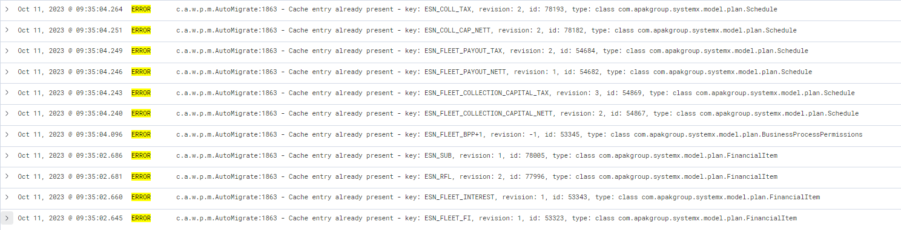

Making use of the scripts found in: ![[Work.Sopra.Fleet#adding-fleet-finance-product-via-scripts]]

I changed the second script slightly to:
```java
import java.io.File;  
import org.apache.commons.io.FileUtils;
import javax.faces.context.FacesContext;
import javax.servlet.http.HttpServletResponse;
import java.util.zip.ZipFile;
import org.apache.commons.io.IOUtils;

import com.apakgroup.systemx.controllers.automigrate.AutoMigrateService;
import com.apakgroup.wfs.base.util.FileUtil;

Set<String> constituentFileSet = new HashSet<String>();
constituentFileSet.add("<filename>");
File exportZipFile = new File(FileUtil.getTempDir() + "TEST" + "export.zip");
AutoMigrateService autoMigrateService = context.getBean("autoMigrateService");
autoMigrateService.exportDcZip( exportZipFile, 12755, constituentFileSet, true, true, "wfs", "test", null);
//file, dcId, constituentFileSet, currentRevisionsOnly, omitDeleted, wfsVersion, environment, criticalReportGroup

FacesContext facesContext = FacesContext.getCurrentInstance();
HttpServletResponse response = (HttpServletResponse) facesContext.getExternalContext().getResponse();
response.setContentType("text/xml");
response.setHeader("Content-Disposition",
		"<filename>.xml");
OutputStream output = response.getOutputStream();
//Read zip as input stream using zip entry
ZipFile zipFile = new ZipFile(exportZipFile.getPath());
String fileName = "<filename>.xml"
IOUtils.copy(zipFile.getInputStream(zipFile.getEntry(fileName)), output);


FacesContext.getCurrentInstance().responseComplete();
```
But got 11 errors for the export of plan, when viewing this in kibana I realised it was all to do with Ellie's ESN_FLEET stuff:


`MigrationException 11 errors occurred in export - see logged ERROR entries for details`

This was better than when I had `currentRevisionsOnly, omitDeleted` both set to `false`, as I got over 2000 errors probably due to cached data.