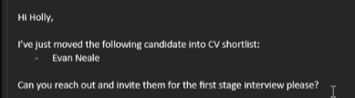

## Early Notes on some examples
- Kai winter: overall decent CV, seems fairly proficient in C++, this is good as is an OOP language, would be interested in bringing him for first stage purely based on this fact and the maths background, and see how he faired on the technical side with Java/if he's done any self learning
- Ugochukwu Ernest NNodu (last in list, oldest): only real issue is living in Fareham I think, has Java qualification but through JetBrains academy, experience with spring and JUnit seems valuable here, another worth the first stage

## Movement to statuses
- When rejecting, (click mail button) `Send free negative email after phone screening` tick "No-reply" (auto changes status)
- When accepting go into mail and do the assessment option then change status to assessment sent
- Assessment has to have been done within 5 days - if failed aptitude then `send free negative email after phone screening`
- Check that they have a right to work in the UK
- Good to see grades in CV
- Where are they based

## When passed assessment
- Criteria move them to interview
- Talentfinder move to shortlist no email
- Email holly
  

## Moved to Smart Recruiters now
- Applications under jobs
- Integration of criteria tbc
- To send a test go into assessments, browse and then select the role (probably graduate software developer) - then move them forward to the Skills test
- Once past skills test move them to interview 1, send holly an email (CC Jack, Rich, Natasha Smart, possibly everyone)

- Look in screening before resume, then resume, (criminal offence, unwilling to relocate or CCJ then instant no)

### Rejection
- Sopra now mandates a rejection reason, select from a dropdown, options:
    - Don't send rejection email
    - Lots of things, 3 most common are most likely *not eligible to work in this country, didn't meet minimum qualifications, mismatch betweene experience and job*
- To find job add, go Jobs -> Graduate Software Developer -> Click shortened link at the top of the page 