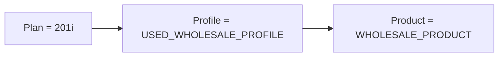

SX-66921
### Setup new webapp
Using the `setup_new_webapp` script as this is stability branch `.388`, follow and use the *snakecase*, and the path to the folder `C:\Users\alexajones2\git\wfs-388`

```cmd
Name of app in snake case [e.g. test_app]: wfs_388

Attempting to create directory wfs_388 in current directory...

Directory does not exist. Creating directory wfs_388...

Directory wfs_388 created in current directory.

Creating scripts in wfs_388 directory...

Scripts for wfs_388 created.

Creating .properties files in wfs_388 directory ...
Persisting property APP_NAME=wfs_388 to wfs_388/run_wfs_388.properties...

Path to your app's repo [e.g. C:\Users\user\git\WFS]: C:\Users\alexajones2\git\wfs-388
Persisting property APP_HOME=C:\Users\alexajones2\git\wfs-388 to wfs_388/run_wfs_388.properties...

Folder name of module to be deployed [e.g. wfs-ui, or blank if not a multi-module maven project]: wfs-ui
Persisting property DEPLOYMENT_MODULE=wfs-ui to wfs_388/run_wfs_388.properties...

Fully qualified path to exploded war (leave empty if generated by maven)
[e.g. C:\Users\user\git\wfs\wfs-ui\target\wfs-ui-8.70-SNAPSHOT]:
Persisting property WAR_PATH= to wfs_388/run_wfs_388.properties...

Path to web application content root (directory where .xhtml files are located, relative to application root): wfs-ui\WebRoot
Persisting property WEBROOT=wfs-ui\WebRoot to wfs_388/run_wfs_388.properties...

Path to JDK (leave empty if using your default JAVA_HOME environment variable):
Persisting property JDK_PATH= to wfs_388/run_wfs_388.properties...

Path to Maven (leave empty if using your default M2_HOME environment variable)
Persisting property MAVEN_HOME= to wfs_388/run_wfs_388.properties...

HTTP port to access application [defaults to 8080 if left blank]: 8091
Persisting property HTTP_PORT=8091 to wfs_388/run_wfs_388.properties...

The debug port exposed to connect a debugger to the running web application [defaults to 8000 if left blank]:

Context path for URL (i.e. http:://localhost:8091/<context path>) [defaults to WFS_388 if left blank]:
Persisting property CONTEXT_PATH=WFS_388 to wfs_388/run_wfs_388.properties...

Setting Catalina base directory to $HOME/servers/$CONTEXT_PATH-tomcat...
Persisting property CATALINA_BASE_DIR=$HOME/servers/$CONTEXT_PATH-tomcat to wfs_388/run_wfs_388.properties...
Resolving operating system...Persisting property OS=WINDOWS to wfs_388/run_wfs_388.properties...
Setup completed

If you wish to amend any of the properties, you may manually edit the run_wfs_388.properties file under the newly created wfs_388 directory.
You may also want to refer to script.properties at the root of this repo to edit properties that can be applied to all apps running on tomcat via these scripts.
Properties in script.properties which are also defined in run_wfs_388.properties will be overwritten, so you can manually define those variables in run_wfs_388.properties in case you missed any during the setup.
Lastly, you may want to review run_wfs_388.properties and script.properties to check if you have incorrectly entered any of the properties.

To deploy your web app, navigate to the new wfs_388 directory under scripts in your bash and try running ./run_wfs_388
```

### Running locally
- Max sent a csv with the relevant data, to do this go into co-authorisation, something along EDL file upload and upload 
- Ran the tomcat script, but when running `./run_wfs_388 start` had problems due to it being on shutdown port **8005** which is used by a windows process, go into tomcat folder in servers and go to `conf/server.xml` and change to **8090**.
- Was running into 
- Have made it so HoB uses SYSX_USER, 578 uses SYS_USER2, and 388 uses SYSX_USER3 (pain was trying to use SYSX_USER1, which didn't exist) see pain points

### Cloud
[haydock env c100](https://c100-batest.apak.delivery/portal.faces)
- 201A plan has same BR as the 201i (problem plan) viewed through `finance plans > 201i > edit > look in the asset section`


### Layout of C100-BATEST



### Problem
- Recreated locally by checking business rules at Product level, saw that the `VALIDATE_VEHICLE_AGE_AT_START` rule was there 3 times with `FEED` `ONLINE` `FEED_LOAD` for a min month of 0 and max of 120 and a type of rejection, put this into my local as the crux of the ticket was 10year+ old cars not being rejected 


### Patrick's response to BA
So I had a look with Alex at this and we're not any closer to figuring out what went wrong. The age at start business rule on our test environments and locally  seems to be triggering as expected if we send in csv loads where the reg_date is older than 120 months. 
The logs for the units they complained about seem to be in line with what went on in the U.I where we had certain alerts raised but not the AGE_AT_START 
([logs for the curious ones amongst you](https://kibana.apak.delivery/app/discover#/context/6f1b5520-3084-11ea-8158-13cf6e6ef45b/OsHSt4oBiISXjp-XPT5f?_g=(filters:!())&_a=(columns:!(host,level,message,thread),filters:!(('$state':(store:appState),meta:(alias:!n,disabled:!f,index:'6f1b5520-3084-11ea-8158-13cf6e6ef45b',key:host,negate:!f,params:(query:prod-c100),type:phrase),query:(match_phrase:(host:prod-c100))),('$state':(store:appState),meta:(alias:!n,disabled:!t,index:'6f1b5520-3084-11ea-8158-13cf6e6ef45b',key:message,negate:!f,params:!(ET12RZB,SALLSAAG5DA764536),type:phrases,value:'ET12RZB,%20SALLSAAG5DA764536'),query:(bool:(minimum_should_match:1,should:!((match_phrase:(message:ET12RZB)),(match_phrase:(message:SALLSAAG5DA764536))))))),predecessorCount:10,sort:!(datetime,desc),successorCount:30))). 
Unfortunately quite difficult to figure out what went wrong when we can't recreate it and the logs don't point to any reasons why this business rule was not triggered. 
 
As Alex mentioned, unless they've messed around with their business rules we are out of ideas for now. Unsure if the invoice_date_backdated business rule somehow had an impact on this at all, but thats all our theories for now


### Update
| VIN |	VRM |	CAP code |	Result|
| ---| --- | ---        | ---   |
WAUZZZF52JA024846	| YG17NGB |	AUA530S862CDTA4 2	| Couldn't populate from CAP, asset not found exception yet is present in Sopra CAP_DERIVATIVE table
WDC1679232A128094	| CK69XHX |	LEGS35 4SHIA 2	| Not present in CAP_DERIVATIVE table (HOWEVER there is `LEGS35   4SHIA  2` which has 3 blank spaces in the first gap, and 2 in the second - NOT 1 and 1)
VF3VEAHXHJZ046126	| AF18KHC |	PETR20AG85EDTM	| present in Sopra CAP_DERIVATIVE table - clicking populate returns to loan screen
VF7VAYHVKJZ103461	| HN68AEK |	CIST15F085EDTM	| present in Sopra CAP_DERIVATIVE table and can populate - and can populate (funding history issue)
VF3VABHXHHZ059535	| DL17WMM |	PETR16A8L5EDTM	| present in Sopra CAP_DERIVATIVE table and can populate - listed as RED in c100-batest but BLUE in CAP_DERIVATIVE 
VF3VEEHZ7MZ103517	| MW71GXY |	PETR2088S5EDTA	| present in Sopra CAP_DERIVATIVE table and can populate - listed as BLACK in c100-batest but BLUE in CAP_DERIVATIVE
YARVEAHXKGZ152664	| LR20EPO |	TOPV20FME5EDTM	| present in Sopra CAP_DERIVATIVE table and can populate but no colour listed
VF7VAYHVKJZ137905	| LM20AUN |	CIST15F285EDTM	| present in Sopra CAP_DERIVATIVE table and can populate - listed as SILVER in c100-batest but BLUE in CAP_DERIVATIVE
VF3VAYHVKJZ128381	| DN68UYK |	PETR15B295EDTM	| present in Sopra CAP_DERIVATIVE table and can populate - listed as BEIGE in c100-batest but BLUE in CAP_DERIVATIVE

[Error logs](https://kibana.apak.delivery/app/discover#/?_g=(filters:!(),refreshInterval:(pause:!t,value:0),time:(from:'2024-02-13T12:00:00.000Z',to:'2024-02-13T12:20:00.000Z'))&_a=(columns:!(level,message,class),filters:!(('$state':(store:appState),meta:(alias:!n,disabled:!f,index:'6f1b5520-3084-11ea-8158-13cf6e6ef45b',key:host.keyword,negate:!f,params:(query:wfs-application-c100-batest-0),type:phrase),query:(match_phrase:(host.keyword:wfs-application-c100-batest-0))),('$state':(store:appState),meta:(alias:!n,disabled:!f,index:'6f1b5520-3084-11ea-8158-13cf6e6ef45b',key:message,negate:!t,params:(query:'c.a.c.t.c.PlaceHolderEncryptor:22'),type:phrase),query:(match_phrase:(message:'c.a.c.t.c.PlaceHolderEncryptor:22'))),('$state':(store:appState),meta:(alias:!n,disabled:!f,index:'6f1b5520-3084-11ea-8158-13cf6e6ef45b',key:message,negate:!t,params:(query:SUCCESS),type:phrase),query:(match_phrase:(message:SUCCESS))),('$state':(store:appState),meta:(alias:!n,disabled:!f,index:'6f1b5520-3084-11ea-8158-13cf6e6ef45b',key:message,negate:!t,params:(query:'c.a.s.u.j.e.ResponseTimesPhaseListener:106%20-%204e938446-9e54-4953-93ea-1cd4a84af7d4,%2FnewLoanPlanSelection.xhtml,ORIGINAL,,,,,,,406'),type:phrase),query:(match_phrase:(message:'c.a.s.u.j.e.ResponseTimesPhaseListener:106%20-%204e938446-9e54-4953-93ea-1cd4a84af7d4,%2FnewLoanPlanSelection.xhtml,ORIGINAL,,,,,,,406')))),index:'6f1b5520-3084-11ea-8158-13cf6e6ef45b',interval:auto,query:(language:kuery,query:''),sort:!())) from Feb 13th 2024

So some entries were able to populate but as you can see in table top 2 couldn't. Patrick spotted in the logs that the error was kicking off from `CAPVehicleLookup.getValuationPrice()`

```java
 try {
            int regYear = deriveRegYear(valuationLookup, 0);
            BigDecimal bd = BigDecimal.valueOf(valuationLookup.getMileage());
            int mileage = bd.divide(new BigDecimal(1000), 0, BigDecimal.ROUND_UP).intValue();

            List result = null;
            DetachedCriteria criteria = DetachedCriteria.forClass(CAPVehiclePrice.class)
                    .add(Restrictions.eq("vehicleTypeCode", valuationLookup.getVehicleType().getValue()))
                    .add(Restrictions.eq("vehicleId", "" + valuationLookup.getDerivativeId()))
                    .add(Restrictions.eq("status", new Integer(1)))
                    .add(getlookupTypeCriteria(valuationLookup.getVehicleLookupType()));
            if (!valuationLookup.getVehicleLookupType().equals(VehicleLookupType.newVehicle)) {
                criteria.add(Restrictions.eq("plateLetter", valuationLookup.getRegistrationLetter()));
                if (!valuationLookup.getLowestMileageBand()) {
                    criteria.add(Restrictions.le("baseMileage", mileage));
                }
                if (regYear > 0) {
                    criteria.add(Restrictions.eq("manufactureYear", regYear));
                }
            }

            if (!valuationLookup.getLowestMileageBand()) {
                criteria.addOrder(Order.desc("baseMileage"));
            } else {
                criteria.addOrder(Order.asc("baseMileage"));
            }
            criteria.addOrder(Order.asc("adjCleanPrice"));
            result = findByCriteria(criteria);

            if (result != null && !result.isEmpty()) {
                CAPVehiclePrice price = (CAPVehiclePrice) result.get(0);
                getCurrentSession().evict(price);
                price.setCurrentMileage(mileage);
                return price;
            } else if (CollectionUtils.isNullOrEmpty(result) && !valuationLookup.getLowestMileageBand()) {
                valuationLookup.setLowestMileageBand(true);
                return getValuationPrice(valuationLookup);
            }
```

Used script runner and the correct bean etc to convert into SQL query:
```java
import org.hibernate.internal.CriteriaImpl;
import com.apakgroup.systemx.assetlookup.cap.CAPVehiclePrice;
import org.hibernate.criterion.DetachedCriteria;
import org.hibernate.Criteria;
import org.hibernate.criterion.Restrictions;
import com.apakgroup.systemx.assetlookup.cap.CAPVehicleLookup;

dao = context.getBean('capLookup'); 

Criteria criteria = dao.sessionFactory.getCurrentSession().createCriteria(CAPVehiclePrice.class)
                    .add(Restrictions.eq("vehicleTypeCode", new Integer(1))) //can be "car"
                    .add(Restrictions.eq("vehicleId", "" + "2.0 BlueHDi 150 Allure Long [8 Seat] 5dr"))
                    .add(Restrictions.eq("status", new Integer(1)))

new org.hibernate.loader.
```
And returned this SQL:
```SQL
SELECT this_.PRICE_ID AS PRICE_ID1_4_0_
	,this_.ADJ_AVERAGE_PRICE AS ADJ_AVERAGE_PRICE2_4_0_
	,this_.ADJ_BELOW_AVERAGE_PRICE AS ADJ_BELOW_AVERAGE_3_4_0_
	,this_.ADJ_CLEAN_PRICE AS ADJ_CLEAN_PRICE4_4_0_
	,this_.ADJ_RETAIL_PRICE AS ADJ_RETAIL_PRICE5_4_0_
	,this_.BASE_AVERAGE_PRICE AS BASE_AVERAGE_PRICE6_4_0_
	,this_.BASE_BELOW_AVERAGE_PRICE AS BASE_BELOW_AVERAGE7_4_0_
	,this_.BASE_CLEAN_PRICE AS BASE_CLEAN_PRICE8_4_0_
	,this_.BASE_MILEAGE AS BASE_MILEAGE9_4_0_
	,this_.BASE_RETAIL_PRICE AS BASE_RETAIL_PRICE10_4_0_
	,this_.CAP_TYPE AS CAP_TYPE11_4_0_
	,this_.PRICING_CATEGORY AS PRICING_CATEGORY12_4_0_
	,this_.MANUFACTURE_YEAR AS MANUFACTURE_YEAR13_4_0_
	,this_.MILEAGE_RANGE_END AS MILEAGE_RANGE_END14_4_0_
	,this_.NEW_COST AS NEW_COST15_4_0_
	,this_.REGISTRATION_LETTER AS REGISTRATION_LETT16_4_0_
	,this_.STATUS AS STATUS17_4_0_
	,this_.VAT_COST AS VAT_COST18_4_0_
	,this_.CAP_ID AS CAP_ID19_4_0_
	,this_.PRODUCT_TYPE AS PRODUCT_TYPE20_4_0_
FROM CAP_PRICE this_
WHERE this_.PRODUCT_TYPE = ?
	AND this_.CAP_ID = ?
	AND this_.STATUS = ?
```

Script runner query CAP
`context.getBean("capLookup").executeSql("SELECT * FROM CAP_DERIVATIVE LIMIT 50").toString();`


```SQL
String sqlStr = "select this_.PRICE_ID as PRICE_ID1_4_0_, this_.ADJ_AVERAGE_PRICE as ADJ_AVERAGE_PRICE2_4_0_, this_.ADJ_BELOW_AVERAGE_PRICE as ADJ_BELOW_AVERAGE_3_4_0_, this_.ADJ_CLEAN_PRICE as ADJ_CLEAN_PRICE4_4_0_, this_.ADJ_RETAIL_PRICE as ADJ_RETAIL_PRICE5_4_0_, this_.BASE_AVERAGE_PRICE as BASE_AVERAGE_PRICE6_4_0_, this_.BASE_BELOW_AVERAGE_PRICE as BASE_BELOW_AVERAGE7_4_0_, this_.BASE_CLEAN_PRICE as BASE_CLEAN_PRICE8_4_0_, this_.BASE_MILEAGE as BASE_MILEAGE9_4_0_, this_.BASE_RETAIL_PRICE as BASE_RETAIL_PRICE10_4_0_, this_.CAP_TYPE as CAP_TYPE11_4_0_, this_.PRICING_CATEGORY as PRICING_CATEGORY12_4_0_, this_.MANUFACTURE_YEAR as MANUFACTURE_YEAR13_4_0_, this_.MILEAGE_RANGE_END as MILEAGE_RANGE_END14_4_0_, this_.NEW_COST as NEW_COST15_4_0_, this_.REGISTRATION_LETTER as REGISTRATION_LETT16_4_0_, this_.STATUS as STATUS17_4_0_, this_.VAT_COST as VAT_COST18_4_0_, this_.CAP_ID as CAP_ID19_4_0_, this_.PRODUCT_TYPE as PRODUCT_TYPE20_4_0_ from CAP_PRICE this_ where this_.PRODUCT_TYPE=1 and this_.CAP_ID='33920' and this_.STATUS=1";

dao = context.getBean('capLookup'); 
rows = dao.sessionFactory.getCurrentSession().createSQLQuery(sqlStr).list().toString(); 
output = ""; 
for(String row: rows){ 
	output += row; logger.info(row); 
} 
return output;
```
Calling from CAP_PRICE now not CAP_DERIVATIVE so need to check that table. Checking the `CAPVehicleDetails` class showed me what the columns were in order, this was then using the CAP_ID (**NOT** CAP_CODE - column 3 of CAP_DERIVATIVE) to check against `CAP_PRICE` table, despite the fact that some things I could populate on the UI and others I couldn't, all returned information from this query.