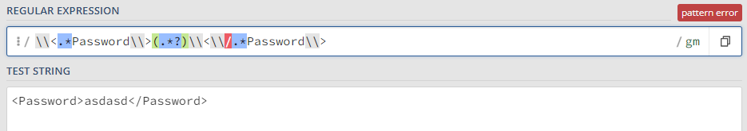
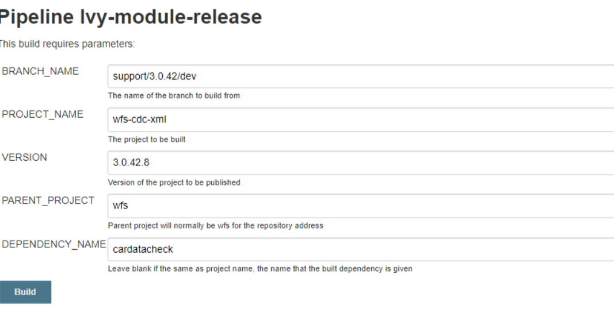

## HPI Error Logs print username and password in plain text
This was simply pulling an old fix done by Jim and done here: https://bitbucket.apak.delivery/projects/WFS/repos/wfs-cdc-xml/pull-requests/53/overview

Basically addition of a final String that is just asterisks to replace any password visible. Then adding a `sanitisePassword()` method to `HPIDom4Enquiry.java`
```java
 protected String sanitisePassword(String request) {
        Pattern pattern = Pattern.compile("\\<.*Password\\>(.*?)\\<\\/.*Password\\>}");
        Matcher matcher = pattern.matcher(request);

        if(matcher.find()) {
            String substr = matcher.group(1);
            return request.replace(substr, DISPLAY_PASSWORD);
        }
        return request;
    }
```

And a test:
```java
@Test
    public void testLoggedErrorSanitisesPassword() throws SOAPException {
        Document doc = createResponseOutputStreamBody(CUSTOMER_CODE, INITIALS, PASSWORD, VIN, HPI_CODE, "CAPCD");

        //given
        HPIDom4jEnquiry enquiry = getEnquiry();

        // when
        String response = enquiry.sanitisePassword(doc.asXML());

        //then
        assertTrue(response.contains("********"));
        assertFalse(response.contains(PASSWORD));
    }

    private Document createResponseOutputStreamBody(String customerCode, String initials, String password, String vin, String primaryProduct, String supplementaryProduct) {
        Document doc = DocumentFactory.getInstance().createDocument();
        Element root = doc.addElement("EnquiryRequest");
        root.addNamespace("ns1", "http://webservices.hpi.co.uk/SupplementaryEnquiryV1");
        doc.setRootElement(root);

        Element authElement = root.addElement("Authentication");

        Element subscriberElement = authElement.addElement("SubscriberDetails");

        Element customerCodeElement = subscriberElement.addElement("CustomerCode");
        customerCodeElement.addText(customerCode);

        Element initialsElement = subscriberElement.addElement("Initials");
        initialsElement.addText(initials);

        Element passwordElement = subscriberElement.addElement("Password");
        passwordElement.addText(password);

        Element requestElement = root.addElement("Request");

        Element assetElement = requestElement.addElement("Asset");

        Element vinElement = assetElement.addElement("Vin");
        vinElement.addText(vin);

        Element primaryProductElement = requestElement.addElement("PrimaryProduct");

        Element codeElement = primaryProductElement.addElement("Code");
        codeElement.addText(primaryProduct);

        Element supplementaryProductElement = requestElement.addElement("SupplementaryProduct");

        Element supplementaryCodeElement = supplementaryProductElement.addElement("Code");
        supplementaryCodeElement.addText(supplementaryProduct);

        return doc;
    }
```

This test was failing, found I could use [Regex 101](https://www.regex101.com) and it showed that my regex: `\\<.*Password\\>(.*?)\\<\\/.*Password\\>` didn't match text between password


But with a slight change, namely `<.*Password>(.*?)<\/.*Password>` it now matched. The test passes.

Then once merged, bumped the `build.version` in `build.xml` to `42.8` so I could release the ivy module https://jenkins.apak.delivery/job/Ivy-module-release/. (Didn't need to do this as the build had been bumped and was ahead) Manually tagged the merged commit with `3.0.42.7`

I had to replace this
```
<credentials host="artifactory.apak.delivery" realm="Artifactory Realm" username="${repo.user}" passwd="${repo.pass}"/>
```
with
```
<properties environment="env"/>
<property name="artifactory.user" value="${env.ARTIFACTORY_USER}" override="false"/>
<property name="artifactory.pass" value="${env.ARTIFACTORY_PASS}" override="false"/>
<credentials host="artifactory.apak.delivery" realm="Artifactory Realm" username="${artifactory.user}" passwd="${artifactory.pass}"/>
```

But do not commit this, provided you have the *environment variables* set up under those names on your machine it will pull dependencies from artifactory.
However, it shouldn't be committed as when using the jenkins Ivy_module_release job it'll fail pulling dependencies.




Had to use this [jenkins job - cdc module](https://jenkins.apak.delivery/job/CDC_Module/) and followed the parameters of Chris' last build. When it passed had to update the version in `wfs-core/pom.xml` to the new tag `3.0.42.8` and get approval.

```xml
<dependency>
    <groupId>com.apakgroup</groupId>
    <artifactId>cardatacheck</artifactId>
    <version>3.0.42.8</version>
</dependency>
```


### Issue
Reopened due to logging of passwords still showing up on [`HPIDom4jEnquiry#57`](https://kibana.apak.delivery/app/discover#/?_g=(filters:!(),refreshInterval:(pause:!t,value:0),time:(from:now-15h,to:now))&_a=(columns:!(message),filters:!(('$state':(store:appState),meta:(alias:!n,disabled:!f,index:'6f1b5520-3084-11ea-8158-13cf6e6ef45b',key:host.keyword,negate:!f,params:(query:wfs-application-wfs-prod-c71-0),type:phrase),query:(match_phrase:(host.keyword:wfs-application-wfs-prod-c71-0)))),index:'6f1b5520-3084-11ea-8158-13cf6e6ef45b',interval:auto,query:(language:kuery,query:'message:%20HPIDom4jEnquiry'),sort:!())) which was all to do with a missing call of detail sanitisation. Simple fix to add sanitise to this line
`logger.debug("Performing HPI Request: {}", sanitiseDetails(domRequest.getRequestAsString()));`

Added changes, updated build `42.0.9 -> 42.0.10` and then ran the `CDC_Module` release job on Jenkins. Then just need to update `wfs-core/pom.xml` `cardatacheck` version.