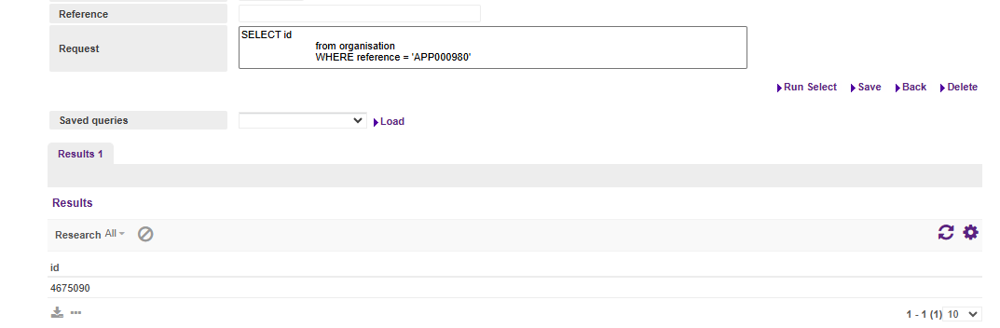
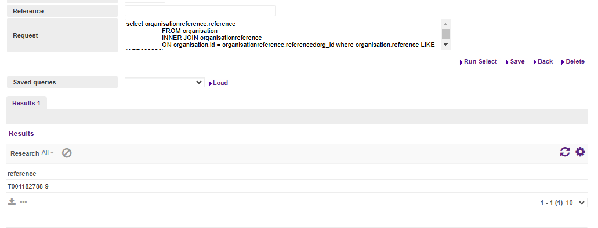

# Critical ticket

## Live Script
```Java
/*******************************************
JIRA: ETFR-536

Author: Alex Jones

Description: Fix broken organisation reference pointer by setting its pointer to one used by a different organisationreference, okay as they all have unique references, and setting it to active so the reporter can delete it properly

********************************************/
orgRef = "APP000980"; //affected dealer
supplierOfAnotherOrgCode = 61806; //a reference used by another (working) organisationreference under this dealer, also accounting like the affected orgref
repairSql = """
UPDATE organisationreference
set referencingorg_id = ${supplierOfAnotherOrgCode},
currententitystatus = 'ACTIVE'
WHERE referencedorg_id = (SELECT id
from organisation
WHERE reference = '${orgRef}')
AND referencingorg_id IS NULL
AND reference = (select organisationreference.reference 
FROM organisation
INNER JOIN organisationreference
ON organisation.id = organisationreference.referencedorg_id where organisation.reference LIKE '${orgRef}' 
AND organisationreference.currententitystatus NOT LIKE 'ACTIVE'
AND organisationreference.referencingorg_id IS NULL)
""";
int count = context.getBean("agreementDAO").executeSqlUpdate(repairSql);


return "Updated "+count+" rows.";
```
Following [these guidelines](https://sf-wiki.atlassian.net/wiki/spaces/WIKI/pages/41275504/Live+Script+Guidelines) and this was [my PR](https://bitbucket.apak.delivery/projects/SCRIPT/repos/scripts/pull-requests/1739/diff#8.47.61/updateBySQL/ETFR-536%20Fix%20null%20referencing%20pointer.groovy)

### Solution
Came through extensive testing on the *sandbox-int-fr* cloud environment.
Flow<br>
DC_1 -><br>
Administration -> Dealers
<br>Select Dealer -> Additional details -> add org reference
<br>-> Set linked organisation reference to "please select" then click remove, it fails
                    
Probably here it sets this null pointer, when viewing this dealer on kibana found this

- First get query to join the organisation and organisation reference table
- Then view and see if there is a null referenced thing in it
- Then write a script, something along these lines - https://bitbucket.apak.delivery/projects/SCRIPT/repos/scripts/pull-requests/1734/diff#8.55/updateBySQL/ETAM-3260-update-loan-identification (replace SQL with mine)
- Then test on sandbox branch - probably replace null with the DEALING COMPANY reference

Then with Paul get the actual exact values needed

Found these values on the C87 (CGI) environment

