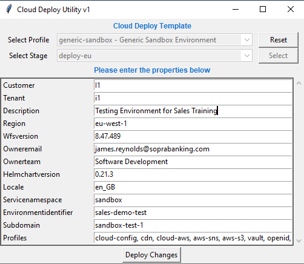

So with cloud you need to pull both the `wfs-production` and `sandbox` repos from the relevant AWS region, for this case it was EU-WEST-1.

For [deleting cloud environments](https://confluence.apak.com/live/display/WIKI/Deleting+a+Cloud+Environment), follow stage 2, then push this as `feature/<etps/hbrd>-<ref>-<typeOfUpdate>-<prod/sandbox>-<envNum>-<words>`, once this is MERGED, then DELETE THE FILES but until then do NOT DO THIS.

## New environment ETPS-2474
First had to follow this page for [templating tool for cloud envs](https://confluence.apak.com/live/display/WIKI/Standard+Application+and+Resource+Definition), which involved me trying to get pip working on the path, I couldn't but `py -m pip <remainderOfCommand>` works, however when doing step 1 it failed and said I had to download the latest C++ build tools from [the website](https://visualstudio.microsoft.com/visual-cpp-build-tools/)

Having issues despite installing as intended, removed problematic packages from `requirements.txt` installed it, then installed them manually namely `ruamel.yaml & PyQt5`



Had to rename all files from `sandbox-test-1*` to `sales-demo-test*` and the same with the hostname in the `application/*.yaml`

#### Delete DB Schema
By bootstrap they meant they wanted no data, so the first thing was to remove the `modelworld` from the `wfs-conf` then update the schema. To do this there's 2 steps, you must first go to [Argo](argo.apak.delivery/applications) and open `sandbox-applications` and `sandbox-resources`:
1. In applications:
    - Filter for `pods` and `stateful sets`, find your environment
2. At the same time open resources:
    - filter for `dbschema`, find your environment, click the three dots and delete - type out the name but **don't** click okay yet (by default you can't delete a schema that's in use)
3. Go to applications and find your environment's stateful set, click the three dots and delete
    - wait for the pod to terminate and the stateful set should change from a green heart to yellow
4. Now go back to resources and hit okay on the delete of the dbschema you set up
5. Sync your `sandbox-resources`
6. When that's done click the 3 dots of your stateful set in `sandbox-applications` and do a local sync of just that, should be much faster
7. Check the environment `<envName>.apak.delivery/WFS`

Double check that the schema in `sandbox` repo has `deletion.protection` as 'unlocked' (this should be the default)

#### Step 1 add modelworld to `sales-demo-test`
To `sales-demo-test.yaml` add to `conf.wfs.core` 
```yaml
      modelworld:
        loaders: mwLoaders.bootstrap
        pfcConfigPropertiesSource: "/spring/system/pfcconfig.properties-lite"
        mwInitialiser: "mwLiteInitializer"
        translations:
          supportedLanguages: en
```

#### Step 2 once PR is approved, add `sales-demo-test` to auto-deploy evergreen to stay up to date with 8.47
Added to the `config.yaml` under `profiles.evergreen-8.47-version.distributions.eu.tasks.sandbox-version.match-values`
```yaml
  evergreen-8.47-version:
    distributions:
      eu:
        tasks:
          prod-version:
            property-type: match
            match-values:
              - <customer-code>
            repository: {unimportant}
            filepath: {unimportant}
            property: {unimportant}
            branchformat: {unimportant}
            commitmessageformat: {unimportant}
          sandbox-version:
            property-type: match
            match-values:
              - ...
              - sales-demo-test
```