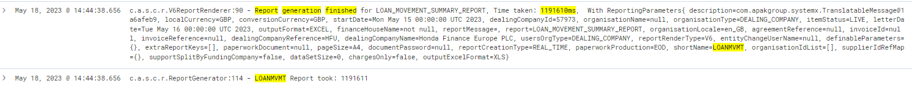
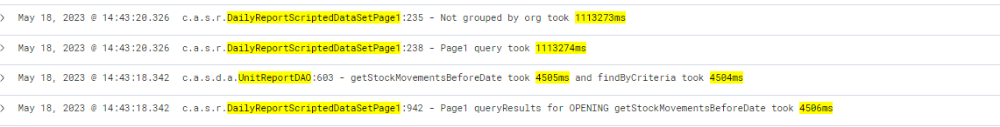
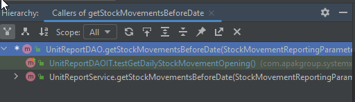
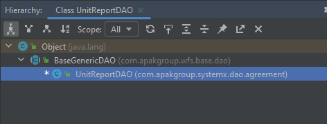
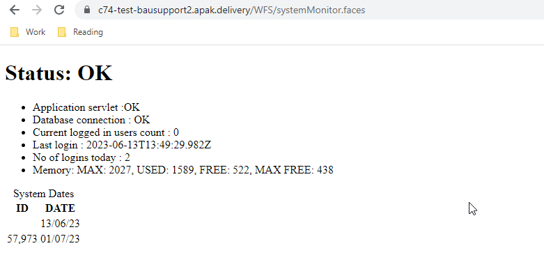

# SX-65126
## Slow generation of Loan Movement Summary Report
Firstly is the *Loan Movement Summary Report EXCEL* **Daily Report** button enabled or not?
I had to recreate the steps in the ticket which were:

    Log into the system and select Dealing Company
    Navigate to Reports > Real Time > Reporting
    Under Daily reports, click Loan Movement Summary Report EXCEL
    Time how long the report takes to generate.
    Report should generate much faster after the fix is applied.

I realised quickly I didn't have the summary report and after a quick message in the 8.47 chat there were 2 options, either the stock movement report (which seemed viable) but then Archana and Jack demonstrated it was an option but needed enabling.

To enable this you should first login as the AdminPFC user then via `System Admin -> Initial Setup -> Configuration Admin` (for whichever Dealing Company) and scroll to Dealing Company reports and click the Daily Dc Reports dropdown and select Loan Movement Summary Report. And had to select it under UI Reports to display it on the system.

Created a Loan via loan management, the only hiccups were how to navigate options, and also a VIN (vehicle identification number was needed) so I generated one and it was `2HHYD28618H200871` (must be 17 digits).

To do this I had to first check the AC, which is as follows

    GIVEN: The Loan Movement Summary Report is enabled
    WHEN: The Loan Movement Summary Report is generated in Realtime reporting
    THEN: The report is generated in a reasonable time frame given the size of the data output 

Spent ages trying to recreate locally, lots of errors to do with the fact I was getting no NettCost but then Chris informed me that due to the volume of data it was best to use a cloud test machine.
After a brief convo with Michael he sussed out it was [C74](https://c74-bausupport.apak.delivery/WFS/portal.faces) (this was in the client code of the ticket) and then I could generate the report with their data, then use the *Thread Dump Recovery Tool* in *System Admin, the first pass took 3minutes and 40seconds to generate.

To get into those environments otherwise download the repos `acc-dev-machine-conf` and `asp-dev-machine-conf` (this one more often), generally don't touch ACC or LIVE environments, and then add yourself in the users.yml and push to remote. Then you should get email with logon, if issues then change the sequence number.

If you change `core.conf` you need to rebuild, otherwise you can change local.conf you can just restart tomcat, something like `show_sql` can `ctrl+shift+f` for and find in a spring xml or something similar and then add the full string to `local.conf`.

With thread dumps its a dump of all the things that are happening at that given time, so best to copy and paste into notepad and do multiple before process ends and then find.

### Process with Jack
*Kibana* - useful system for looking at logs of all systems, live, dev environments and otherwise, can look specifically for environment and maybe my username, change times etc

Try and get a snapshot release out (ask Chris).
For mine, the version was 8.47.220.37, so I branched off of that, another way to do it may be to do multiple thread dumps again and find kind of hotpoints where things mix together. For this there is `DailyReportScriptedDataSetPage1` and 2 and 3, so add some high level logging, then get a bit more specific on methods and find where timings get a bit slower and try and be as specific as possible, use the TimeRecord object like Jack showed me in the `FeedSingleActionProcessor`. With those hotpoints 


```java
 TimeRecord tr = new TimeRecord();

FeedSingleActionProcessedResult feedActionProcessedResult = processSingleAction(actionElement, feed, handler);

LOGGER.info("{} - Processed action {} in {}ms", FeedLoggingFormatProvider.getFormattedString(feed), handler.getClass().getSimpleName(), tr.stop());
```
In reports there's layout and scripted dataset, and scripted dataset gets put in report layout. 

### First step
Made 7 thread dumps while the report generated, the thread that was involved on the Loan Movement Summary Report was `pool-3-thread-1`, from using `ctrl+f` to find that, I could find points of interest across each instance of the thread dump.
- `UnitReportDAO.getDailyStockMovementNonLiveOpeningBalance` and `UnitReportService` & `ReportService`
- `UnitReportDAO.getStockTransferMovementsOnDate` and for `UnitReportService` & `ReportService`
- `DailyReportScriptedDataSetPage1`
    - `.generateSummaryRowsForNonLiveLoans`
    - `.query`
    - `.getStockMovementsForDate`
    - `.getDailyMovementReconciliations`
    - `.getLiveReconciliations`
    - `.generateSummaryRowsByBusinessProcessForLiveLoans`
    - `.getStockTransferMovementsOnDate`
- `UnitReportDAO.getStockMovementsOnDate` and for `UnitReportService` & `ReportService`
- `UnitReportDAO.getStockTransferMovementsOnDate` and for `UnitReportService` & `ReportService`
- When done there's `UnitReportDAO.getUnitLevelReportResults` and for `UnitReportService` & `ReportService`

In `DailyReportScriptedDataSetPage1.java` in the private `query()` method there's an *if*-statement
```java
if (isGroupingByOrganisation) { ... }
```
And I was informed to check how this is set (defaults in class as false at top level but) via a bean `ctrl+shift+f` and change file mask to *\*.xml* and can see in `ReportContext.xml` it is by default set to true for `DailyReportScriptedDataSetPage` 1,2, & 3

### Build Snapshot version
You will need to trigger this job with your feature branch to build the release

https://jenkins.apak.delivery/job/WFS_Snapshot_Build/

Then since it is a cloud environment you will need to trigger this one to build the docker image

https://jenkins.apak.delivery/job/wfs-docker/

- To build you must do the snapshot first using `Build with Parameters` and put the snapshot version then maybe add something meaningful like the date on the end, it will fail if it ends or starts with a 0.
- Then you must wait until this is finished and then click master on the second link, then use the build with parameters and put in the same snapshot version, i.e. because I made this release first on the 10th of may I used `8.47.220.37.10.5.23`

 Had an issue building and Chris said if I see `[ERROR] javac: invalid flag --release` it means the java version is wrong, what I needed in the pipeline snapshot build:
- GIT_BRANCH: feature/sx-65126-investigate-loan-summary-report-off-tag
- SNAPSHOT_VERSION: 8.47.220.37.10.5.23
- JAVA_VERSION: openjdk 11

Then for second step make the VERSION: `<version.additional>-SNAPSHOT`
Latest = `8.47.220.37.11.5.23-SNAPSHOT`

After this builds, ask all users of the environment if its okay to update the release and let them know the changes that were made and what (if anything) it could break.

Then proceed to the next step.

Repositories -> Sandbox : definitions of all cloud environments
- Resources: database credential stuff, experian is asset evaulation stuff
- Applications: basic definitions of environments
    - change version of WFS
    - `conf` : is like local conf for the env
    - basically change tag to my version, for this is c74-bausupport
    - edit in the UI if needs be, commit and create PR and once ticked wait for jenkins, add -SNAPSHOT to the end of version

Go into argo, sandbox applications then synchronize it `argo.apak.delivery/applications` 

A combination of these 2 (more specific to cloud envs is) -> [Build with docker image](https://jenkins.apak.delivery/job/WFS_FEATURE_BRANCH_WITH_DOCKER_IMAGE/)
### Kibana logs
Before adding logging there were only 3 logs being shown, when the LOAN_MOVEMENT_SUMMARY_REPORT started, then saying something to do with `LOANMVMT` and then the report finishing, so logs were added to commonly seen methods throughout the generation in the `System Admin -> Recovery Tools -> Thread Dump Recovery Tool` by repeatedly loading this and copying the contents across to a notepad file to see what was being called throughout.

Ideal is to add the highest level possible, so for example do DailyReportScriptedDataSetPage1, 2, and 3, start with that and drill into service and just say do the service layer stuff, then once you know where the time has come from drill into the DAO.

### Query length
Managed to boil it down to 4 methods causing the most time being used, which upon logging the findByCriteria() method returned these times:
- `getStockMovementsBeforeDate` - **4475ms**
- `UnitReportDAO:756 - getStockTransferMovementsOnDate` took **461755ms**
- `getStockTransferMovementOnDate` - found out this was caused by `getStockTransferMovementsOnDateByBPE` - **10767ms**
- `getDailyStockMovementNonLiveOpeningBalance` - **3335ms**
- `getPaymentProcessingOnDate` - **1568ms**

<br>
<br>
<br>

### Process of finding SQL query for getStockMovementsBeforeDate()
- Choose a method that was slow from the DAO class and find out if there's an integration test
- As the 4 methods were from `UnitReportDAO` looked for the `UnitReportDAOIT` and e.g `.getStockMovementsBeforeDate()` found the test that uses it which was line 1222
```java
public void testGetDailyStockMovementOpening() {
        Long dcId = getDcId("DCUK");

        StockMovementReportingParameters stockMovementParameters = new StockMovementReportingParametersBuilder()
                .date(DateUtil.newDate(2007, 2, 1))
                .dealingCompanyId(dcId)
                .itemStatus(ItemStatus.LIVE)
                .itemType(ItemType.ASSET)
                .currency(Currency.GBP)
                .build();

        List<IReconciliation> list = unitReportDAO.getStockMovementsBeforeDate(stockMovementParameters, false, null,
                false, null);
        assertEquals(1, list.size());
        IReconciliation openingBalance = list.get(0);
        assertEquals(new Long("17"), openingBalance.getTotalUnits());
        assertBDEquals(new BigDecimal("330851.07"), openingBalance.getNettCost());
        assertBDEquals(new BigDecimal("57898.93"), openingBalance.getVatCost());
        assertBDEquals(new BigDecimal("388750.00"), openingBalance.getGrossCost());
    }
```
- However, as it was in `test -> com -> blah blah` it was old test, and the DcID was old modelworld data, just changed it from `"DCUK"` to `"DC_1"`
- Then stepped into methods, all the way to `findByCriteria` (Deprecated)
- In evaluate expression run this
```java
new org.hibernate.loader.criteria.CriteriaJoinWalker( 
    (org.hibernate.persister.entity.OuterJoinLoadable) 
            ((CriteriaImpl)<VARIABLENAME>).getSession().getFactory().getEntityPersister(
                 ((CriteriaImpl)<VARIABLENAME>).getSession().getFactory().getImplementors(
                     ((CriteriaImpl)<VARIABLENAME>).getEntityOrClassName())[0]), 
    new org.hibernate.loader.criteria.CriteriaQueryTranslator( 
        ((CriteriaImpl)<VARIABLENAME>).getSession().getFactory(), 
        ((CriteriaImpl)<VARIABLENAME>), 
        ((CriteriaImpl)<VARIABLENAME>).getEntityOrClassName(), 
        org.hibernate.loader.criteria.CriteriaQueryTranslator.ROOT_SQL_ALIAS), 
    ((CriteriaImpl)<VARIABLENAME>).getSession().getFactory(), 
    (CriteriaImpl)<VARIABLENAME>, 
    ((CriteriaImpl)<VARIABLENAME>).getEntityOrClassName(), 
    ((CriteriaImpl)<VARIABLENAME>).getSession().getLoadQueryInfluencers() 
).getSQLString();
```
- Then in Notepad++ with the Poor man's T SQL formatter, formatted the query returned
```SQL
SELECT count(this_.id) AS y0_
	,sum(this_.nettCost) AS y1_
	,sum(this_.vatCost) AS y2_
	,sum(businesspr8_.utilised) AS y3_
	,statustran6_.itemStatus AS y4_
FROM Item this_
LEFT OUTER JOIN TITLE_ITEM this_1_ ON this_.id = this_1_.items_id
INNER JOIN Item agreementi1_ ON this_.agreementInvoice_id = agreementi1_.id
LEFT OUTER JOIN TITLE_ITEM agreementi1_1_ ON agreementi1_.id = agreementi1_1_.items_id
INNER JOIN Organisation dc5_ ON agreementi1_.dealingCompany_id = dc5_.id
INNER JOIN Organisation dealer2_ ON agreementi1_.owner_id = dealer2_.id
INNER JOIN PLAN plan3_ ON agreementi1_.plan_id = plan3_.id
INNER JOIN FIHolder fiholder9_ ON this_.financialItemHolder_id = fiholder9_.id
INNER JOIN FinancialItem financiali10_ ON fiholder9_.financialItem_id = financiali10_.id
INNER JOIN Item_StatusTransaction statushist18_ ON this_.id = statushist18_.Item_id
INNER JOIN StatusTransaction statustran6_ ON statushist18_.statusHistory_id = statustran6_.id
LEFT OUTER JOIN BusinessProcessEvent businesspr8_ ON statustran6_.businessProcessEvent_id = businesspr8_.id
INNER JOIN sec_identity user7_ ON statustran6_.user_id = user7_.id
LEFT OUTER JOIN Organisation supplier4_ ON this_.supplier_id = supplier4_.id
WHERE agreementi1_.id IN (
		SELECT ai1_.id AS y0_
		FROM Item item_
		LEFT OUTER JOIN TITLE_ITEM item_1_ ON item_.id = item_1_.items_id
		INNER JOIN Item ai1_ ON item_.agreementInvoice_id = ai1_.id
		LEFT OUTER JOIN TITLE_ITEM ai1_1_ ON ai1_.id = ai1_1_.items_id
		WHERE NOT item_.itemType IN (
				?
				,?
				)
		)
	AND (
		this_.itemType = ?
		OR (
			this_.itemType = ?
			AND financiali10_.effectOnFunding <> ?
			)
		)
	AND dc5_.id = ?
	AND statustran6_.itemStatus = ?
	AND statustran6_.effectiveDate < ?
	AND (
		statustran6_.endDate >= ?
		OR statustran6_.endDate IS NULL
		)
	AND agreementi1_.currency = ?
GROUP BY statustran6_.itemStatus
```
Now the job is finding the ? and replacing them so that I can evaluate the expression in PGAdmin, I did this through some careful debugging of the method and asking around on knowledge in the system:
```SQL
    WHERE NOT item_.itemType IN (
				'INTERNAL_ACCOUNT'
				, "AMORTIZED LOAN"
                #found in getAgreementInvoicesForItemType() in UnitReportDAO from getBaseCriteria
				)
		)
 ```
```SQL
    AND (
		this_.itemType = 'ADDITIONAL_ITEM'
		OR (
			this_.itemType = 'ASSET'
			AND financiali10_.effectOnFunding <> 'NONE'
			)
		)
```
- `dc5_.id = 12658`
- `statustran6_.itemStatus = 'LIVE'`
- `statustran6_.effectiveDate < '2007-02-01'`
- `statustran6_.endDate >= '2007-02-01'`

- `agreementi1_.currency = 'GBP'`

Found out that in SQL, quotes are done in single inverted commas, also for doing the query locally, all tables must have `"SYXS_USER2".` before them, or the relevant SYX_USER that was setup.

When in classes you can find the hierarchy of method calls by selecting and using `ctrl+alt+h` and then if pre-populated just go a row down and double click to see
<br>
<br> and `ctrl+h` shows the callers of the class.
<br>


#### Query I put in the ScriptRunner
```Java
sqlStr = """ 
	EXPLAIN (
		SELECT count(this_.id) AS y0_
		,sum(this_.nettCost) AS y1_
		,sum(this_.vatCost) AS y2_
		,sum(businesspr8_.utilised) AS y3_
		,statustran6_.itemStatus AS y4_
		FROM Item this_
		LEFT OUTER JOIN TITLE_ITEM this_1_ ON this_.id = this_1_.items_id
		INNER JOIN Item agreementi1_ ON this_.agreementInvoice_id = agreementi1_.id
		LEFT OUTER JOIN TITLE_ITEM agreementi1_1_ ON agreementi1_.id = agreementi1_1_.items_id
		INNER JOIN Organisation dc5_ ON agreementi1_.dealingCompany_id = dc5_.id
		INNER JOIN Organisation dealer2_ ON agreementi1_.owner_id = dealer2_.id
		INNER JOIN PLAN plan3_ ON agreementi1_.plan_id = plan3_.id
		INNER JOIN FIHolder fiholder9_ ON this_.financialItemHolder_id = fiholder9_.id
		INNER JOIN FinancialItem financiali10_ ON fiholder9_.financialItem_id = financiali10_.id
		INNER JOIN Item_StatusTransaction statushist18_ ON this_.id = statushist18_.Item_id
		INNER JOIN StatusTransaction statustran6_ ON statushist18_.statusHistory_id = statustran6_.id
		LEFT OUTER JOIN BusinessProcessEvent businesspr8_ ON statustran6_.businessProcessEvent_id = businesspr8_.id
		INNER JOIN sec_identity user7_ ON statustran6_.user_id = user7_.id
		LEFT OUTER JOIN Organisation supplier4_ ON this_.supplier_id = supplier4_.id
		WHERE agreementi1_.id IN (
			SELECT ai1_.id AS y0_
			FROM Item item_
			LEFT OUTER JOIN TITLE_ITEM item_1_ ON item_.id = item_1_.items_id
			INNER JOIN Item ai1_ ON item_.agreementInvoice_id = ai1_.id
			LEFT OUTER JOIN TITLE_ITEM ai1_1_ ON ai1_.id = ai1_1_.items_id
			WHERE NOT item_.itemType IN (
					'INTERNAL_ACCOUNT'
					, 'AMORTIZED_LOAN'
					)
			)
		AND (
			this_.itemType = 'ADDITIONAL_ITEM'
			OR (
				this_.itemType = 'ASSET'
				AND financiali10_.effectOnFunding <> 'NONE'
				)
			)
		AND dc5_.id = 57973
		AND statustran6_.itemStatus = 'LIVE'
		AND statustran6_.effectiveDate < '2023-05-15'
		AND (
			statustran6_.endDate >= '2023-05-15'
			OR statustran6_.endDate IS NULL
			)
		AND agreementi1_.currency = 'GBP'
		GROUP BY statustran6_.itemStatus
		)
	""";
dao = context.getBean('agreementDAO'); 
rows = dao.sessionFactory.getCurrentSession().createSQLQuery(sqlStr).list(); 
output = ""; 
for(String row: rows){ 
	output += row; logger.info(row); 
} 
return output;
```

and the output returned was:
```
GroupAggregate  (cost=4.53..37.79 rows=1 width=112)
  Group Key: statustran6_.itemstatus  ->  Nested Loop Semi Join  (cost=4.53..37.76 rows=1 width=28)
        ->  Nested Loop  (cost=3.68..36.47 rows=1 width=44)
              ->  Nested Loop Left Join  (cost=3.41..36.18 rows=1 width=52)
                    ->  Nested Loop  (cost=2.98..34.97 rows=1 width=57)
                          ->  Nested Loop  (cost=2.55..32.83 rows=4 width=41)
                                ->  Nested Loop  (cost=2.12..32.06 rows=1 width=33)
                                      Join Filter: (((this_.itemtype)
::text = 'ADDITIONAL_ITEM'::text)
 OR (((this_.itemtype)
::text = 'ASSET'::text)
 AND ((financiali10_.effectonfunding)
::text <> 'NONE'::text)
)
)
                                      ->  Nested Loop  (cost=1.85..31.75 rows=1 width=51)
                                            ->  Nested Loop  (cost=1.43..31.28 rows=1 width=51)
                                                  ->  Nested Loop  (cost=1.15..26.98 rows=1 width=59)
                                                        ->  Nested Loop  (cost=1.00..22.79 rows=1 width=67)
                                                              ->  Nested Loop  (cost=0.85..18.62 rows=1 width=75)
                                                                    ->  Index Scan using idx_itm_dlncmp_id on item agreementi1_  (cost=0.42..8.45 rows=1 width=32)
                                                                          Index Cond: (dealingcompany_id = 12658)
                                                                          Filter: ((currency)
::text = 'GBP'::text)
                                                                    ->  Index Scan using fk_item_invid on item this_  (cost=0.42..10.16 rows=1 width=51)
                                                                          Index Cond: (agreementinvoice_id = agreementi1_.id)
                                                                          Filter: (((itemtype)
::text = 'ADDITIONAL_ITEM'::text)
 OR ((itemtype)
::text = 'ASSET'::text)
)
                                                              ->  Index Only Scan using organisation_pkey on organisation dc5_  (cost=0.15..4.17 rows=1 width=8)
                                                                    Index Cond: (id = 12658)
                                                        ->  Index Only Scan using organisation_pkey on organisation dealer2_  (cost=0.15..4.17 rows=1 width=8)
                                                              Index Cond: (id = agreementi1_.owner_id)
                                                  ->  Index Only Scan using idx_plan_id_reference on plan plan3_  (cost=0.29..4.30 rows=1 width=8)
                                                        Index Cond: (id = agreementi1_.plan_id)
                                            ->  Index Scan using fiholder_pkey on fiholder fiholder9_  (cost=0.42..0.47 rows=1 width=16)
                                                  Index Cond: (id = this_.financialitemholder_id)
                                      ->  Index Scan using financialitem_pkey on financialitem financiali10_  (cost=0.27..0.29 rows=1 width=13)
                                            Index Cond: (id = fiholder9_.financialitem_id)
                                ->  Index Only Scan using item_statustransaction_pkey on item_statustransaction statushist18_  (cost=0.43..0.73 rows=4 width=16)
                                      Index Cond: (item_id = this_.id)
                          ->  Index Scan using statustransaction_pkey on statustransaction statustran6_  (cost=0.43..0.53 rows=1 width=32)
                                Index Cond: (id = statushist18_.statushistory_id)
                                Filter: ((effectivedate < '2023-05-15'::date)
 AND ((enddate >= '2023-05-15'::date)
 OR (enddate IS NULL)
)
 AND ((itemstatus)
::text = 'LIVE'::text)
)
                    ->  Index Scan using businessprocessevent_pkey on businessprocessevent businesspr8_  (cost=0.43..1.21 rows=1 width=11)
                          Index Cond: (statustran6_.businessprocessevent_id = id)
              ->  Index Only Scan using sec_identity_pkey on sec_identity user7_  (cost=0.28..0.29 rows=1 width=8)
                    Index Cond: (id = statustran6_.user_id)
        ->  Nested Loop  (cost=0.85..1.28 rows=4 width=16)
              Join Filter: (this_.agreementinvoice_id = item_.agreementinvoice_id)
              ->  Index Only Scan using item_pkey on item ai1_  (cost=0.42..0.48 rows=1 width=8)
                    Index Cond: (id = this_.agreementinvoice_id)
              ->  Index Scan using fk_item_invid on item item_  (cost=0.42..0.74 rows=4 width=16)
                    Index Cond: (agreementinvoice_id = ai1_.id)
                    Filter: ((itemtype)
::text <> ALL ('{INTERNAL_ACCOUNT,AMORTIZED_LOAN}'::text[])
)

)

```
Which was unformatted but using the **show all characters** showed me they were using spaces and not tabs, could then find and replace ")" with ")\n" after ticking allow extended characters.


### getStockTransferMovementsOnDate() - most expensive
Returns SQL base of:
```SQL
SELECT count(this_.id) AS y0_
	,sum(this_.nettCost) AS y1_
	,sum(this_.vatCost) AS y2_
	,sum(businesspr8_.utilised) AS y3_
	,statustran6_.itemStatus AS y4_
FROM Item this_
LEFT OUTER JOIN TITLE_ITEM this_1_ ON this_.id = this_1_.items_id
INNER JOIN Item agreementi1_ ON this_.agreementInvoice_id = agreementi1_.id
LEFT OUTER JOIN TITLE_ITEM agreementi1_1_ ON agreementi1_.id = agreementi1_1_.items_id
INNER JOIN Organisation dc5_ ON agreementi1_.dealingCompany_id = dc5_.id
INNER JOIN Organisation dealer2_ ON agreementi1_.owner_id = dealer2_.id
INNER JOIN PLAN plan3_ ON agreementi1_.plan_id = plan3_.id
INNER JOIN FIHolder fiholder9_ ON this_.financialItemHolder_id = fiholder9_.id
INNER JOIN FinancialItem financiali10_ ON fiholder9_.financialItem_id = financiali10_.id
INNER JOIN Item_StatusTransaction statushist18_ ON this_.id = statushist18_.Item_id
INNER JOIN StatusTransaction statustran6_ ON statushist18_.statusHistory_id = statustran6_.id
LEFT OUTER JOIN BusinessProcessEvent businesspr8_ ON statustran6_.businessProcessEvent_id = businesspr8_.id
INNER JOIN sec_identity user7_ ON statustran6_.user_id = user7_.id
LEFT OUTER JOIN Organisation supplier4_ ON this_.supplier_id = supplier4_.id
WHERE agreementi1_.id IN (
		SELECT ai1_.id AS y0_
		FROM Item item_
		LEFT OUTER JOIN TITLE_ITEM item_1_ ON item_.id = item_1_.items_id
		INNER JOIN Item ai1_ ON item_.agreementInvoice_id = ai1_.id
		LEFT OUTER JOIN TITLE_ITEM ai1_1_ ON ai1_.id = ai1_1_.items_id
		WHERE NOT item_.itemType IN (
				?
				,?
				)
		)
	AND (
		this_.itemType = ?
		OR (
			this_.itemType = ?
			AND financiali10_.effectOnFunding <> ?
			)
		)
	AND dc5_.id = ?
	AND statustran6_.itemStatus = ?
	AND statustran6_.effectiveDate = ?
	AND (
		statustran6_.endDate >= ?
		OR statustran6_.endDate IS NULL
		)
	AND agreementi1_.currency = ?
GROUP BY statustran6_.itemStatus
ORDER BY statustran6_.itemStatus ASC
```

This turned into the script:
```JAVA
sqlStr = """ 
	EXPLAIN (
		SELECT count(this_.id) AS y0_
			,sum(this_.nettCost) AS y1_
			,sum(this_.vatCost) AS y2_
			,sum(businesspr8_.utilised) AS y3_
			,statustran6_.itemStatus AS y4_
		FROM Item this_
		LEFT OUTER JOIN TITLE_ITEM this_1_ ON this_.id = this_1_.items_id
		INNER JOIN Item agreementi1_ ON this_.agreementInvoice_id = agreementi1_.id
		LEFT OUTER JOIN TITLE_ITEM agreementi1_1_ ON agreementi1_.id = agreementi1_1_.items_id
		INNER JOIN Organisation dc5_ ON agreementi1_.dealingCompany_id = dc5_.id
		INNER JOIN Organisation dealer2_ ON agreementi1_.owner_id = dealer2_.id
		INNER JOIN PLAN plan3_ ON agreementi1_.plan_id = plan3_.id
		INNER JOIN FIHolder fiholder9_ ON this_.financialItemHolder_id = fiholder9_.id
		INNER JOIN FinancialItem financiali10_ ON fiholder9_.financialItem_id = financiali10_.id
		INNER JOIN Item_StatusTransaction statushist18_ ON this_.id = statushist18_.Item_id
		INNER JOIN StatusTransaction statustran6_ ON statushist18_.statusHistory_id = statustran6_.id
		LEFT OUTER JOIN BusinessProcessEvent businesspr8_ ON statustran6_.businessProcessEvent_id = businesspr8_.id
		INNER JOIN sec_identity user7_ ON statustran6_.user_id = user7_.id
		LEFT OUTER JOIN Organisation supplier4_ ON this_.supplier_id = supplier4_.id
		WHERE agreementi1_.id IN (
				SELECT ai1_.id AS y0_
				FROM Item item_
				LEFT OUTER JOIN TITLE_ITEM item_1_ ON item_.id = item_1_.items_id
				INNER JOIN Item ai1_ ON item_.agreementInvoice_id = ai1_.id
				LEFT OUTER JOIN TITLE_ITEM ai1_1_ ON ai1_.id = ai1_1_.items_id
				WHERE NOT item_.itemType IN (
						'INTERNAL_ACCOUNT'
							, 'AMORTIZED_LOAN'
						)
				)
			AND (
				this_.itemType = 'ADDITIONAL_ITEM'
				OR (
					this_.itemType = 'ASSET'
					AND financiali10_.effectOnFunding <> 'NONE'
					)
				)
			AND dc5_.id = 57973
			AND statustran6_.itemStatus = 'LIVE'
			AND statustran6_.effectiveDate = '2023-05-15'
			AND (
				statustran6_.endDate >= '2023-05-15'
				OR statustran6_.endDate IS NULL
				)
			AND agreementi1_.currency = 'GBP'
		GROUP BY statustran6_.itemStatus
		ORDER BY statustran6_.itemStatus ASC
	)
	""";
dao = context.getBean('agreementDAO'); 
rows = dao.sessionFactory.getCurrentSession().createSQLQuery(sqlStr).list(); 
output = ""; 
for(String row: rows){ 
	output += row; logger.info(row); 
} 
return output;
```

You may notice the dealerId has changed, the reason the cost was so low is I was still using DC_1 id instead of the system "HFU" which in kibana logs had an id of *57973* and when this was put in it returned a much heavier cost of:
```
GroupAggregate  (cost=4521.86..37869.54 rows=2 width=112)
  Group Key: statustran6_.itemstatus  ->  Nested Loop Semi Join  (cost=4521.86..37869.48 rows=2 width=28)
        ->  Nested Loop  (cost=4521.01..37867.17 rows=2 width=44)
              ->  Nested Loop Left Join  (cost=4520.73..37866.40 rows=2 width=52)
                    ->  Nested Loop  (cost=4520.31..37849.62 rows=2 width=57)
                          Join Filter: (((this_.itemtype)
::text = 'ADDITIONAL_ITEM'::text)
 OR (((this_.itemtype)
::text = 'ASSET'::text)
 AND ((financiali10_.effectonfunding)
::text <> 'NONE'::text)
)
)
                          ->  Hash Join  (cost=4520.03..37848.69 rows=3 width=75)
                                Hash Cond: (this_.id = statushist18_.item_id)
                                ->  Merge Join  (cost=1023.70..34315.23 rows=9895 width=51)
                                      Merge Cond: (agreementi1_.plan_id = plan3_.id)
                                      ->  Nested Loop  (cost=1001.59..138997.25 rows=9895 width=59)
                                            ->  Gather Merge  (cost=1001.44..138869.39 rows=9895 width=67)
                                                  Workers Planned: 2                                                  ->  Nested Loop  (cost=1.42..136727.24 rows=4123 width=67)
                                                        ->  Nested Loop  (cost=1.00..134807.24 rows=4123 width=67)
                                                              ->  Nested Loop  (cost=0.85..134126.09 rows=4123 width=75)
                                                                    ->  Parallel Index Scan using idx_itm_pln_id on item agreementi1_  (cost=0.42..79760.99 rows=15176 width=32)
                                                                          Filter: ((dealingcompany_id = 57973)
 AND ((currency)
::text = 'GBP'::text)
)
                                                                    ->  Index Scan using fk_item_invid on item this_  (cost=0.42..3.57 rows=1 width=51)
                                                                          Index Cond: (agreementinvoice_id = agreementi1_.id)
                                                                          Filter: (((itemtype)
::text = 'ADDITIONAL_ITEM'::text)
 OR ((itemtype)
::text = 'ASSET'::text)
)
                                                              ->  Index Only Scan using organisation_pkey on organisation dealer2_  (cost=0.15..0.17 rows=1 width=8)
                                                                    Index Cond: (id = agreementi1_.owner_id)
                                                        ->  Index Scan using fiholder_pkey on fiholder fiholder9_  (cost=0.42..0.47 rows=1 width=16)
                                                              Index Cond: (id = this_.financialitemholder_id)
                                            ->  Materialize  (cost=0.15..4.17 rows=1 width=8)
                                                  ->  Index Only Scan using organisation_pkey on organisation dc5_  (cost=0.15..4.17 rows=1 width=8)
                                                        Index Cond: (id = 57973)
                                      ->  Index Only Scan using plan_pkey on plan plan3_  (cost=0.29..416.04 rows=15717 width=8)
                                ->  Hash  (cost=3493.64..3493.64 rows=215 width=32)
                                      ->  Nested Loop  (cost=0.86..3493.64 rows=215 width=32)
                                            ->  Index Scan using idx_statustrans_date_status_bp on statustransaction statustran6_  (cost=0.43..1693.43 rows=215 width=32)
                                                  Index Cond: ((effectivedate = '2023-05-15'::date)
 AND ((itemstatus)
::text = 'LIVE'::text)
)
                                                  Filter: ((enddate >= '2023-05-15'::date)
 OR (enddate IS NULL)
)
                                            ->  Index Scan using uk_n5brbaw22xeuloo0ioxmbh5o5 on item_statustransaction statushist18_  (cost=0.43..8.37 rows=1 width=16)
                                                  Index Cond: (statushistory_id = statustran6_.id)
                          ->  Index Scan using financialitem_pkey on financialitem financiali10_  (cost=0.27..0.29 rows=1 width=13)
                                Index Cond: (id = fiholder9_.financialitem_id)
                    ->  Index Scan using businessprocessevent_pkey on businessprocessevent businesspr8_  (cost=0.43..8.39 rows=1 width=11)
                          Index Cond: (statustran6_.businessprocessevent_id = id)
              ->  Index Only Scan using sec_identity_pkey on sec_identity user7_  (cost=0.28..0.39 rows=1 width=8)
                    Index Cond: (id = statustran6_.user_id)
        ->  Nested Loop  (cost=0.85..1.28 rows=4 width=16)
              Join Filter: (this_.agreementinvoice_id = item_.agreementinvoice_id)
              ->  Index Only Scan using item_pkey on item ai1_  (cost=0.42..0.48 rows=1 width=8)
                    Index Cond: (id = this_.agreementinvoice_id)
              ->  Index Scan using fk_item_invid on item item_  (cost=0.42..0.74 rows=4 width=16)
                    Index Cond: (agreementinvoice_id = ai1_.id)
                    Filter: ((itemtype)
::text <> ALL ('{INTERNAL_ACCOUNT,AMORTIZED_LOAN}'::text[])
)

```
### Resolution 
- After having found out that through the use of Chris' groovy/java query on the Script Runner on the cloud env:
```
sqlStr = """ 
	EXPLAIN (<SQLQUERY>)
	""";
dao = context.getBean('agreementDAO'); 
rows = dao.sessionFactory.getCurrentSession().createSQLQuery(sqlStr).list(); 
output = ""; 
for(String row: rows){ 
	output += row; logger.info(row); 
} 
return output;
```
I found some explain plans, then copy and pasting these into notepad++ and reformatting by replacing all ")" with ")\n" it seemed I needed to check what the indexes were on heavy tables, indexes being a combination of columns (with low cardinality or variability) so that data can be retrieved more efficiently.
- To find the indexes of given tables I went into the SQL runner and used the query
```
select *
from pg_indexes
where tablename not like 'pg%';
```
<br>
Can also use in PGAdmin:

```SQL
SELECT
    tablename,
    indexname,
    indexdef
FROM
    pg_indexes
WHERE
    schemaname = 'SYSX_USER2'
ORDER BY
    tablename,
    indexname;
```
However, this was for all tables, and so the return was vaguely limited, so if I wanted to check specific tables I could cross reference with my PGAdmin from local instance *localhost:9000* and then replace `not like` with `like/is/= '<stringOfTableName>'` 

The tables that seem to be heavy calls are:
- `item`
- `statustransaction`
- `financialitem`

Creating a unique index
```java
sqlStr = """ 
		CREATE UNIQUE INDEX item_aj_invoicejoin
		ON item (agreementinvoice_id, valuetype, status, itemtype, id);
	""";
dao = context.getBean('agreementDAO'); 
rows = dao.sessionFactory.getCurrentSession().createSQLQuery(sqlStr).list(); 
output = ""; 
for(String row: rows){ 
	output += row; logger.info(row); 
} 
return output;
```

This seemed to not work, maybe due to returning a list, changed to this:
```java
sqlStr = """ 
		CREATE UNIQUE INDEX item_aj_statustransaction
		ON statustransaction (id, itemstatus, status, version);
	""";
dao = context.getBean('agreementDAO'); 
rows = dao.sessionFactory.getCurrentSession().createSQLQuery(sqlStr); 
rows.executeUpdate();
output = ""; 
for(String row: rows){ 
	output += row; logger.info(row); 
} 
return output;
```

The heaviest for `stockMovementsOnDate` seems to occur because of the `financialItem` table, so I've been reading this link [sql index considerations](https://www.sqlshack.com/top-five-considerations-for-sql-server-index-design/) to understand how to create an index that will be most helpful in cutting down the time.

To get a new index thought about by the system you have to run the end of day `vacuumanalysis` which will need to be activated.

### Matthew Ellams approach to similar problems
In this case my approach to finding the problem was roughly:

1. find which report is slow (which you can get from the logs on test/live machines)
2. Isolate which SQL query is slow (which you can get from either using tools like visual vm or just walking through the code)
3. I often do things like use script runner to poke at parts of dev machines when people are having issues 
Replicate the SQL for the slow query (hopefully you can all roughly do that)<br>
Also notice that the code here has not changed for a long time - whatever is making it slow now is likely external to SFPW
4. Notice that the SQL I have is not anywhere near as slow as what hibernate is generating<br>
Especially notice that the explain plan is also not as high-cost as it should be for the time it take
5. Investigate on the internet why this could happen / make the intuitive leap to it being related to bind parameters
6. Experiment with converting the query to bind parameters and notice it is now slow matching what we were seeing in production<br>
Still get confused why the explain plan is low cost
7. Persuade tech to let me run a query with Autotrace (this is not common/normal/possible in most situations) which shows that the actual path the query is taking is very different to the explain plan and is doing a full table scan of StatusTransaction (which is one of the biggest tables on the system)
8. Look at the way this table is being used - spot that we are applying restrictions against it on two sides of an Or condition that are easily optimisable if you know the values up front but cannot be optimised in a bind parameters query 
9. Experiment with rewriting the query to avoid this given I know what parameters are being passed in

Potentially won't work for me as I'm working on cloud env not live machine.


### Steps with Tim
- Removed unused joins that were on and saw a roughly 25% increase in performance on the explain plan.
```
INNER JOIN Organisation dealer2_ ON agreementi1_.owner_id = dealer2_.id
INNER JOIN PLAN plan3_ ON agreementi1_.plan_id = plan3_.id
```
And changed a WHERE NOT IN to `WHERE item_.itemType <> 'INTERNAL_ACCOUNT' AND item_.itemType <> 'AMORTIZED_LOAN'`
- Time a normal loan movement run for the devidence, then push the fast changes with the new SQL (tested by query conversion) then check another loan movement for the same day, show time improvement, for one method only then start the next method
- Potential speedup also by changing
```SQL
 WHERE NOT item_.itemType IN (
						'INTERNAL_ACCOUNT'
							, 'AMORTIZED_LOAN'
						)
				)
to

WHERE item_.itemType <> 'INTERNAL_ACCOUNT' AND item_.itemType <> 'AMORTIZED_LOAN'
```
and maybe removal of whole above of:
```SQL
WHERE agreementi1_.id IN (
				SELECT ai1_.id AS y0_
				FROM Item item_
				LEFT OUTER JOIN TITLE_ITEM item_1_ ON item_.id = item_1_.items_id
				INNER JOIN Item ai1_ ON item_.agreementInvoice_id = ai1_.id
				LEFT OUTER JOIN TITLE_ITEM ai1_1_ ON ai1_.id = ai1_1_.items_id
```
as does the same as first bit, only the where just mentioned is useful

To re-run locally go `Project Structure -> Project` and change back to java 11 sdk with java 8 lang level and recompile to make JAR again.
### Use of P6Spy
[P6Spy](https://confluence.apak.com/live/display/WIKI/Logging+and+Debugging+SQL+in+WFS+with+P6Spy) - however this would be great but locally the calling of Loan Movement Summary Report doesn't work

### Potentially useful Kibana logs
- [6th June](https://kibana.apak.delivery/app/discover#/?_g=(filters:!(),refreshInterval:(pause:!t,value:0),time:(from:'2023-06-06T09:30:00.000Z',to:'2023-06-06T09:35:37.917Z'))&_a=(columns:!(message),filters:!(),index:'6f1b5520-3084-11ea-8158-13cf6e6ef45b',interval:auto,query:(language:kuery,query:'message:%20(%22Starting%20generation%22%20OR%20%22Report%20generation%20finished%22%20OR%20LOANMVMT%20OR%20DailyReportScriptedDataSetPage1%20OR%20UnitReportDAO)'),sort:!()))


### Issues
- *Funded assets by dealer reports* requires `dealer` which comes from `getBaseCriteria()` `crit.createAlias("agreementInvoice.owner", "dealer");`
- *Loan approval to live* requires `plan` which comes from `getBaseCriteria()` `crit.createAlias("agreementInvoice.plan", "plan");` and the method invoking it is `UnitReportDAO.getPreliveToLiveReportResults()` 
- *Loan Cancellation Report* needs `plan` also from `getBaseCriteria()` `crit.createAlias("agreementInvoice.plan", "plan");` and the method requiring it is `getUnitLevelReportResults()`
- *Loan Dealer Transfer* needs plan as it requires `plan.reference` and the top method needing it is `getTransferUnitLevelReportResults()`
- *Loan Deconsign* needs `plan.reference` and top level that needs it is `getUnitLevelReportResults()`
- *Loan New* needs `plan.reference` coming from `getUnitLevelReportResults()`
- *Loan Plan Transfer* needs `plan.reference` coming from `getTransferUnitLevelReportResults()`
- *Loan Prelive* needs `plan.reference` coming from `getPreliveToLiveReportResults()`
- *Loan Reversal* needs `plan.reference` coming from `getUnitLevelReportResults()`
- *Retail Double Financing, Roll Forward Report, and Loan Movement Summary Report* all suffer from the problem of seemingly infinite generation
- Table `ReportQueueEntry` shows things currently in report queue


#### Check people logged in to cloud env

`<cloud-env-name>.apak.delivery/WFS/systemMonitor.faces`


### Script to remove null `effectOnFunding`
On 9th of August I brought in a model change to `FinancialItem` that upon creation gives a default `EffectOnFunding` value of 'NONE'.
However, some envs are using data from before that, to change this I used a script:
```java
sqlStr = """ 
        update financialitem set effectonfunding ='NONE' where id in ( select fi2.id from financialitem fi2 where effectonfunding is null);
    """;
dao = context.getBean('agreementDAO'); 
rows = dao.sessionFactory.getCurrentSession().createSQLQuery(sqlStr); 
rows.executeUpdate();
return "Script finished: ${rows} Any entities with null effectOnFunding have been set to none";
```

I updated a value in PGAdmin with these executed sequentially:
```SQL
update "SYSX_USER2".financialitem set effectonfunding=null where id=14900;

commit;

select * from "SYSX_USER2".financialitem where effectonfunding is null;
```
I knew this was right by checking the `local.conf` and it said I was using SYSX_USER2.