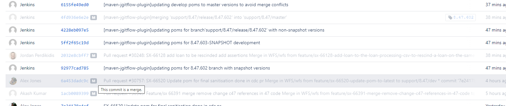

[Jira Workflow confluence](https://confluence.apak.com/live/display/WIKI/JIRA#JIRA-SXIssues)
## Start
Its fine to use `git push --set-upstream origin feature/<yourFeature>` when setting the upstream to push commits.
Also generally when moving to Sprint Prep generally `None` should be selected for merges, you *must* add an original estimate.

## New ticket process as of 12/05
so the 2 main things are:

test locally and on the environment to free up testers for exploratory and further testing
before merging there must be QA approval

So for example for my SX-65127 (reverse event logic serialisation), once locally tested it should be tested on one of the cloud environments, so SX-65126 is on C74 so the environment is C74, but 65127 is client code I1 so what is the cloud env I'd test it on?

Ah as you've just said you just comment which env you tested it on, does this need to be put in the Devidence document also????

At the moment I think we are largely managing the demos and devidence documents pretty well, but we haven't really taken on the sanity testing of SX tickets on the environment at the end.

 

So what I am proposing is changing the flow to:

- Code Review
    - Demo
        - Discussion between dev and tester around where the changes are in order to build risk based regression cases
    - Devidence
        - Reviewed by tester
- Internal Test
    - Developer tests the SX
        - Key principle that the developer needs to have 100% confidence
            - Can be through UI testing, or Automated testing
            - Minimum of one check in the UI manually
        - Developer adds a comment to the ticket
            - Details of what they tested and if it worked
    - Developer transitions the ticket to External UAT once done
- External UAT
    - Provides the queue of work needing the RBRG tasks to be completed by testers
    - Testers check that all steps have been followed and then close the ticket

 

Hopefully this will remove some of the pressure on the testers to keep up with the head of branch releases, and with the additional exploratory testing time end up increasing the coverage of testing we can do. 

## 8.47 
### Testing
So there are some changes coming to the branch with regards to the testing approach.  In short developers are going to be much more responsible for the testing of their tickets, while the testers will be focusing more on running the regression testing.
 
We are going to phase this in for NEW tickets for the bulk of the changes. Anything in flight will probably continue as normal for the most part. This is to take effect immediately. 
 
From now on, when picking up a new ETPS ticket from the backlog your initial task will be the usual of reading through to understand it, maybe debug a little, to get to grips with the task, and then contact the Testers.  Together you will go over the ticket, discuss what changes you are planning, and the AC to ensure that they are fit for purpose, and for the testers to have the opportunity to add any key regression scenarios in which need to be tested as part of the ticket.  At this point you should be able to estimate the ticket relatively accurately.  If however the addition to the AC means a major change in the timeline, please reach out to one of us.
 
After that point the next change will be the Demo.  Instead of the current process where every ticket must be demoed to a tester, instead only the Criticals, Gaps and one with a large amount of AC will require a tester to be present.  For all of the rest just grab another Dev for a quick demo as a second pair of eyes. Add a comment to the ticket about who you demoed the work to.
 
Finally when it comes to the sanity testing, you will be responsible for doing this as usual, however, instead of moving the ticket to Internal Test and leaving it, you will need to complete the transition flow, "Internal Test" -> "External UAT" -> Closed. We aren't expecting a testing doc at this point, you will have already done the Dev evidence, but it will need a comment on the ticket detailing which wfs environment, version and dataset you did the testing on, as well as anything omitted from the testing (ie its covered heavily by automated tests etc) and any issues discovered.
 
This change will be heavily moving the responsibility of the changes in to the hands of developers, there will be no "safety net" of testers checking after. So please pay attention to detail and do what you can to keep quality high.
 
If you have any questions please reach out.

### When closing
The Fix Version field must be updated to include 2 things, the target branch  (e.g. Branch 8.47) and the next version for the target branch (e.g 8.47.726) in which the changes have been merged in. To add a bit more context to this the target branch should be present from the get go on the jira and you'll need this in order to pass the quality gate checks on bitbucket.

However, the next version for the branch(e.g 8.47.726) should only be added to the fix version entry when the pull request is merged!
The Commit Version field should be updated to include any versions where work has been committed to for this issue. For example, when a JIRA is completed for the first time it may have 8.47.725. If it is reopened and completed again this field might say 8.47.725, 8.47.726.

**Commit** - every version where code relating to the ticket has been committed, check this on [line 333](https://bitbucket.apak.delivery/projects/WFS/repos/wfs/browse/pom.xml?at=refs%2Fheads%2Fsupport%2F8.47%2Fdev)

### From patrick
the way you can check is the merge commit that was raised from your pull request merge

which tag version it sits under(8.47.602)

### Fixing forward
If fixing a stability branch, apply fix to all stability branches above and then HoB i.e.
`support/8.47.388/dev -> support/8.47.578/dev -> support/8.47/dev`

**Fix Version** - version where ticket was fixed/merged, should always be 2 (the branch and a specific version which is the latest commit), to find the version go to `8.47/dev` and go to the wfs-core and find the *SNAPSHOT* version from the POM.

**Fix Strategy and Risk Assessment** - If this was to break something in production then how would it be fixed? In Risk Assessment outline the risks and what they would cause and then how to monitor that (i.e. added logging to monitor the job)

Then rename the title of PR and remove feature and have ticket in `CAPITALS-<TICKETNUM>`

### Before pushing
`Pull latest, rebase onto it, then push`

**MERGE** never means merge, for example "I'd like you to complete the merges to 8.47.220 and 8.47.388...for X changes" most likely means cherry pick where the fixes occurred onto the branch.

### After pushing
Go to bitbucket and click the three dots and build and select `Regression Tests` parameters

### Risk Assessments
[James Reynolds](https://confluence.apak.com/live/pages/viewpage.action?spaceKey=~james.reynolds&title=Risk+Analysis+8.47+Draft)

### Ticket Types
CMN - for APAK common work
WMOD - for WFS model work
SX - for WFS work
ETPS - for production and branch work

### Create WMOD ticket
Edit the ETPS ticket issue to see everything needed, click create:
1. Project - WMOD
2. Issue Type - Task
3. Details just add in all the details from ETPS ticket
4. Copy Summary and Description etc
5. Client Code I1
6. No sprint or epic link
7. Link the ticket with SX ticket made and ETPS ticket

### [Merging WMOD ticket](https://confluence.apak.com/live/pages/viewpage.action?pageId=29145650)
1. Model updates -> Model PR up -> Build model PR in jenkins (`WFS Model Feature branch build` in Jenkins, scan multibranch pipeline now, find feature branch) -> Note build version
2. Wfs branch -> insert new model version in POM.xml file -> raise PR, run build to check if works
3. If works -> Merge model PR -> build release version of model -> Note release build version
4. Update model version in wfs branch from the Build in jenkins then merge.

[Model Changes](https://confluence.apak.com/live/pages/viewpage.action?pageId=29145650)

### Merging ticket to next part of branch
- More > Clone ticket and rename to `MERGE of <ticketname>`
- Go into issue links and add a `Merge of <oldSx>` type and delete cloned from
- Then you can push changes on that other branch