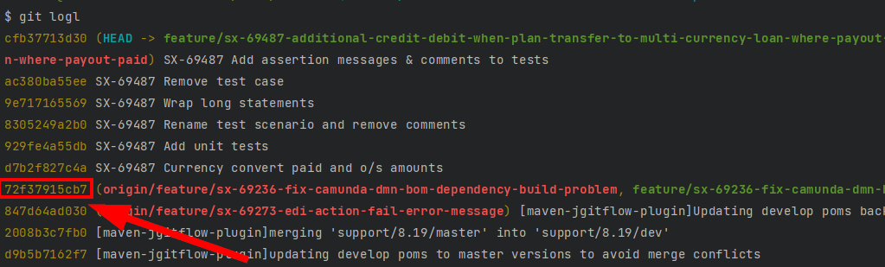
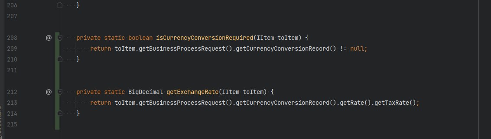
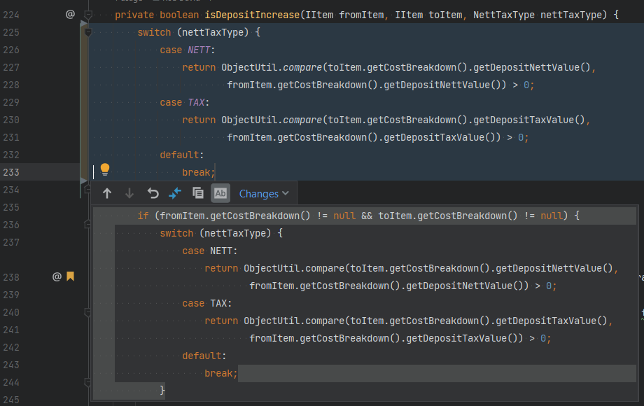

### Checklist

### Aaron's way with big PRs
1) Check out the branch you're reviewing
2) git log to find the commit reference prior to any changes made on the branch
 
3) git reset 72f37915cb7 to reset the changes so they're no longer in the commit history, but are instead in the working directory. This means that you'll be able to navigate around IntelliJ whilst seeing the parts of the code that have changed (green bar in the gutter)

You can also make use of navigating to the Next/Previous Change to see how code has been changed...

**DO NOT push any changes you've made to the local branch to the remote branch!!**
 
To revert the changes to the local branch so that it's in sync with the remote branch:
 
1) Run git reset --hard to remove the uncommitted changes from the working directory
2) If you have untracked files in the working directory, use git clean -fd too to clean those
3) at this stage your local branch is behind the remote branch, git pull to pull the commits you reset earlier back down to your local branch